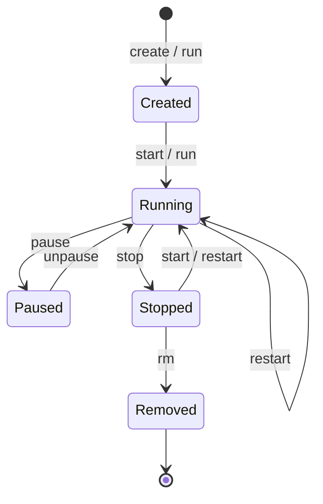

# Images and Containers

## Images

### Pulling images

```bash
# Pull from Docker Hub
docker pull nginx
docker pull nginx:1.25              # Specific version
docker pull nginx:alpine            # Alpine variant (smaller)
docker pull node:20-alpine
docker pull postgres:16-alpine

# Pull from other registries
docker pull ghcr.io/myuser/myapp:latest
```

### Listing images

```bash
docker images
# REPOSITORY   TAG       IMAGE ID       SIZE
# nginx        latest    a8758716bb6a   187MB
# nginx        alpine    1e415315c3ea   43MB
# node         20-alpine 234abc567def   130MB
```

### Image tags

Tags identify specific versions of an image:

```
nginx:latest        → Most recent version (default if no tag specified)
nginx:1.25          → Specific version
nginx:1.25-alpine   → Specific version on Alpine Linux
nginx:alpine        → Latest version on Alpine
node:20             → Node.js 20.x
node:20-alpine      → Node.js 20.x on Alpine (smaller)
node:20-slim        → Node.js 20.x on slim Debian
```

**Always use specific tags in production.** `latest` can change and break things.

### Base image variants

| Variant | Size | Description |
|---------|------|-------------|
| `node:20` | ~1GB | Full Debian with build tools |
| `node:20-slim` | ~200MB | Stripped-down Debian |
| `node:20-alpine` | ~130MB | Alpine Linux (minimal) |
| `ubuntu:22.04` | ~77MB | Ubuntu |
| `alpine:3.19` | ~7MB | Alpine Linux (smallest practical base) |
| `scratch` | 0 bytes | Empty — for static binaries (Go) |

**Alpine** is the most popular choice for production. It's tiny and secure. Some packages might behave differently than Debian, but it works for 95% of cases.

### Removing images

```bash
docker rmi nginx                    # Remove by name
docker rmi a8758716bb6a             # Remove by ID
docker image prune                  # Remove dangling images (untagged)
docker image prune -a               # Remove ALL unused images
docker system prune -a              # Nuclear option: remove everything unused
```

### Image layers

Every instruction in a Dockerfile creates a **layer**. Layers are cached and reused.

```dockerfile
FROM node:20-alpine        # Layer 1: base image
WORKDIR /app               # Layer 2: set directory
COPY package.json .        # Layer 3: copy package.json
RUN npm install            # Layer 4: install dependencies
COPY . .                   # Layer 5: copy source code
```

**Why layers matter:** If only your source code changes (Layer 5), Docker reuses cached layers 1-4 and only rebuilds layer 5. This makes builds fast.

**Ordering matters:** Put things that change least at the top, things that change most at the bottom.

### Inspecting images

```bash
# Image details
docker inspect nginx

# Image history (layers)
docker history nginx

# Image size
docker images --format "{{.Repository}}:{{.Tag}} {{.Size}}"
```

## Containers

### Running containers

```bash
# Basic run
docker run nginx

# Common flags
docker run -d nginx                     # Detached (background)
docker run -d --name my-nginx nginx     # With a name
docker run -d -p 8080:80 nginx          # Port mapping (host:container)
docker run -d -p 80:80 -p 443:443 nginx # Multiple ports
docker run -it ubuntu bash              # Interactive + terminal
docker run --rm nginx                   # Auto-remove when stopped
docker run -d --restart unless-stopped nginx  # Auto-restart

# Environment variables
docker run -d -e NODE_ENV=production -e PORT=3000 myapp
docker run -d --env-file .env myapp
```

### Port mapping explained


- `curl http://localhost:8080` → reaches the container's port 80
- Multiple containers can use the same internal port (e.g., 80) as long as host ports differ

```bash
docker run -d -p 3001:80 --name app1 nginx
docker run -d -p 3002:80 --name app2 nginx
# Both containers run Nginx on port 80 internally
# Accessible on host ports 3001 and 3002
```

### Managing containers

```bash
# List running containers
docker ps

# List ALL containers (including stopped)
docker ps -a

# Stop a container
docker stop my-nginx                    # Graceful (SIGTERM, then SIGKILL)
docker kill my-nginx                    # Immediate (SIGKILL)

# Start a stopped container
docker start my-nginx

# Restart
docker restart my-nginx

# Remove a container
docker rm my-nginx                      # Must be stopped first
docker rm -f my-nginx                   # Force remove (even if running)

# Remove all stopped containers
docker container prune
```

### Container logs

```bash
# View logs
docker logs my-nginx

# Follow logs (like tail -f)
docker logs -f my-nginx

# Last 100 lines
docker logs --tail 100 my-nginx

# Logs with timestamps
docker logs -t my-nginx

# Logs since a time
docker logs --since 1h my-nginx
```

### Executing commands in a running container

```bash
# Open a shell inside the container
docker exec -it my-nginx bash
docker exec -it my-nginx sh       # If bash isn't available (Alpine)

# Run a single command
docker exec my-nginx cat /etc/nginx/nginx.conf
docker exec my-nginx ls /usr/share/nginx/html

# Run as a specific user
docker exec -u root my-nginx whoami
```

### Copying files in/out of a container

```bash
# Copy from host to container
docker cp ./index.html my-nginx:/usr/share/nginx/html/

# Copy from container to host
docker cp my-nginx:/etc/nginx/nginx.conf ./nginx.conf

# Useful for debugging — inspect config files inside a running container
```

### Container resource usage

```bash
# Live resource stats
docker stats

# CONTAINER ID  NAME       CPU %  MEM USAGE  NET I/O   BLOCK I/O
# abc123        my-nginx   0.01%  5MB/512MB   1kB/2kB   0B/0B
# def456        my-api     2.3%   150MB/1GB   50kB/30kB 10MB/5MB

# Stats for specific container
docker stats my-nginx

# One-time snapshot (not live)
docker stats --no-stream
```

### Container lifecycle



### Restart policies

```bash
docker run -d --restart no myapp            # Never restart (default)
docker run -d --restart on-failure myapp    # Restart on crash
docker run -d --restart on-failure:5 myapp  # Max 5 restart attempts
docker run -d --restart unless-stopped myapp # Always, unless manually stopped
docker run -d --restart always myapp        # Always restart

# Update restart policy on existing container
docker update --restart unless-stopped my-nginx
```

For production: use `unless-stopped` or `on-failure`.

## Building Images

### Dockerfile basics

```dockerfile
# Every Dockerfile starts with FROM
FROM node:20-alpine

# Set the working directory inside the container
WORKDIR /app

# Copy dependency files first (for caching)
COPY package.json package-lock.json ./

# Install dependencies
RUN npm ci --production

# Copy the rest of the source code
COPY . .

# Document which port the app uses (doesn't actually expose it)
EXPOSE 3000

# The command to run when the container starts
CMD ["node", "app.js"]
```

### Building

```bash
# Build from current directory
docker build -t myapp .

# Build with a specific tag
docker build -t myapp:v1.0 .
docker build -t myapp:latest -t myapp:v1.0 .    # Multiple tags

# Build with a specific Dockerfile
docker build -f Dockerfile.production -t myapp .

# Build without cache (full rebuild)
docker build --no-cache -t myapp .

# Build and see full output
docker build --progress=plain -t myapp .
```

### Dockerfile instructions reference

| Instruction | Purpose | Example |
|-------------|---------|---------|
| `FROM` | Base image | `FROM node:20-alpine` |
| `WORKDIR` | Set working directory | `WORKDIR /app` |
| `COPY` | Copy files from host | `COPY . .` |
| `ADD` | Like COPY but can extract archives and fetch URLs | `ADD archive.tar.gz /app/` |
| `RUN` | Execute command during build | `RUN npm install` |
| `CMD` | Default command at runtime | `CMD ["node", "app.js"]` |
| `ENTRYPOINT` | Fixed command (CMD becomes arguments) | `ENTRYPOINT ["python"]` |
| `ENV` | Set environment variable | `ENV NODE_ENV=production` |
| `EXPOSE` | Document port (doesn't publish it) | `EXPOSE 3000` |
| `ARG` | Build-time variable | `ARG VERSION=1.0` |
| `USER` | Run as this user | `USER node` |
| `HEALTHCHECK` | Container health check | `HEALTHCHECK CMD curl -f http://localhost/` |

### CMD vs ENTRYPOINT

```dockerfile
# CMD — can be overridden at runtime
CMD ["node", "app.js"]
# docker run myapp               → runs: node app.js
# docker run myapp node test.js  → runs: node test.js (overridden)

# ENTRYPOINT — fixed, CMD becomes default arguments
ENTRYPOINT ["node"]
CMD ["app.js"]
# docker run myapp               → runs: node app.js
# docker run myapp test.js       → runs: node test.js (app.js replaced)
```

### Multi-stage builds

Use multiple `FROM` statements to keep the final image small:

```dockerfile
# Stage 1: Build
FROM node:20-alpine AS build
WORKDIR /app
COPY package*.json ./
RUN npm ci
COPY . .
RUN npm run build

# Stage 2: Production image
FROM nginx:alpine
COPY --from=build /app/dist /usr/share/nginx/html
EXPOSE 80
CMD ["nginx", "-g", "daemon off;"]
```

The final image only contains Nginx + your built files. Node.js and `node_modules` are discarded.

### .dockerignore

Like `.gitignore` — excludes files from the build context:

```
node_modules
.git
.env
dist
build
*.md
.vscode
.idea
__pycache__
*.pyc
```

**Always include this.** Without it, `COPY . .` sends everything (including `node_modules`, `.git`) to the Docker daemon, making builds slow.

---

**Next:** [Volumes](volumes.md)
