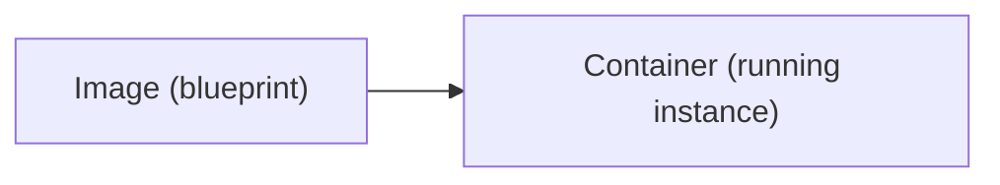
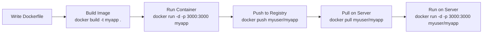

# Introduction to Docker

## What is Docker?

Docker lets you package an application with everything it needs (code, runtime, libraries, config) into a standardized unit called a **container**.

A container is like a lightweight, isolated virtual machine — but it shares the host OS kernel, making it much faster and smaller than a VM.

## Why Docker?

**"Works on my machine"** — The classic problem. Your app runs locally but breaks on the server because of different OS versions, library versions, or missing dependencies. Docker solves this.

| Without Docker | With Docker |
|----------------|-------------|
| Install runtime on server | Runtime is in the image |
| Manage dependencies manually | Dependencies are in the image |
| "Works on my machine" | Works everywhere |
| Conflicting versions across apps | Each app has its own environment |
| Slow server setup | `docker run` and you're done |
| Hard to rollback | Just run the previous image |

## Docker vs Virtual Machines

```mermaid
block-beta
    columns 2
    block:vm:1["Virtual Machines"]
        columns 2
        appA1["App A"] appB1["App B"]
        libsA1["Libs"] libsB1["Libs"]
        guestA["Guest OS"] guestB["Guest OS"]
    end
    block:docker:1["Docker Containers"]
        columns 2
        appA2["App A"] appB2["App B"]
        libsA2["Libs"] libsB2["Libs"]
    end
    hypervisor["Hypervisor"]:1
    engine["Docker Engine"]:1
    hostOS1["Host OS"]:1
    hostOS2["Host OS"]:1
    hw1["Hardware"]:1
    hw2["Hardware"]:1
```

> **VM:** Full OS per app (~GB), Boot time: minutes
> **Container:** Shared kernel (~MB), Start time: seconds

## Core Concepts

### Image

A **read-only template** that contains everything needed to run an application. Think of it as a snapshot/blueprint.

```
Image = OS base + Runtime + Code + Dependencies + Config
```

Images are built from a `Dockerfile` and stored in registries (Docker Hub, GHCR).

### Container

A **running instance** of an image. You can run multiple containers from the same image.



Like: Class → Object, Recipe → Dish

### Registry

A place to store and share images:
- **Docker Hub** (`hub.docker.com`) — Public default registry
- **GitHub Container Registry** (`ghcr.io`) — GitHub's registry
- **Amazon ECR**, **Google GCR** — Cloud provider registries

### Dockerfile

A text file with instructions to build an image:

```dockerfile
FROM node:20-alpine     # Start from a base image
WORKDIR /app            # Set working directory
COPY package.json .     # Copy files
RUN npm install         # Run commands
COPY . .                # Copy remaining files
EXPOSE 3000             # Document the port
CMD ["node", "app.js"]  # Default command when container starts
```

## Installation

```bash
# Install Docker on Ubuntu
curl -fsSL https://get.docker.com | sudo sh

# Add your user to docker group (avoid sudo for docker commands)
sudo usermod -aG docker $USER

# Log out and back in, then verify
docker --version
docker run hello-world
```

## Your First Container

```bash
# Run an Nginx container
docker run -d -p 8080:80 --name my-nginx nginx

# What just happened:
# 1. Docker pulled the 'nginx' image from Docker Hub
# 2. Created a container named 'my-nginx'
# 3. Mapped host port 8080 to container port 80
# 4. Started it in detached mode (-d = background)

# Visit http://localhost:8080 — you'll see the Nginx welcome page

# Stop it
docker stop my-nginx

# Remove it
docker rm my-nginx
```

## Docker Workflow



---

**Next:** [Images and Containers](images-and-containers.md)
