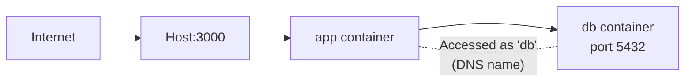

# Docker Networking

Docker networking controls how containers communicate with each other, with the host, and with the outside world.

## Network Drivers

Docker provides several network drivers:

| Driver | Use case |
|--------|----------|
| **bridge** | Default. Containers on same host communicate via a virtual network. |
| **host** | Container shares the host's network stack. No isolation. |
| **none** | No networking at all. |
| **overlay** | Multi-host networking (Docker Swarm). |

## The Default Bridge Network

When you run a container without specifying a network, it joins the default `bridge` network.

```bash
# Run two containers
docker run -d --name app1 nginx
docker run -d --name app2 nginx

# They're on the default bridge network
docker network inspect bridge

# They can communicate by IP...
docker exec app1 ping <app2-ip>

# ...but NOT by name
docker exec app1 ping app2
# ping: bad address 'app2'  ← FAILS
```

**The default bridge does NOT support DNS resolution between containers.** This is why you should always create custom networks.

## Custom Bridge Networks

```bash
# Create a custom network
docker network create mynetwork

# Run containers on that network
docker run -d --name app --network mynetwork myapp
docker run -d --name db --network mynetwork postgres:16

# Now they CAN communicate by name
docker exec app ping db
# PING db (172.18.0.3): 56 data bytes  ← WORKS

# Your app can connect to the database as:
# postgres://user:pass@db:5432/mydb
#                       ^^ container name works as hostname
```

### Why custom networks are essential

1. **DNS resolution** — Containers can reach each other by name
2. **Isolation** — Only containers on the same network can communicate
3. **Automatic cleanup** — Easy to manage groups of related containers

## Network Commands

```bash
# List networks
docker network ls

# Create a network
docker network create mynetwork

# Inspect a network (see connected containers, IPs)
docker network inspect mynetwork

# Connect a running container to a network
docker network connect mynetwork my-container

# Disconnect a container from a network
docker network disconnect mynetwork my-container

# Remove a network
docker network rm mynetwork

# Remove all unused networks
docker network prune
```

## Container Communication Patterns

### Pattern: App + Database

```bash
# Create network
docker network create app-network

# Start database
docker run -d \
  --name db \
  --network app-network \
  -v pgdata:/var/lib/postgresql/data \
  -e POSTGRES_PASSWORD=secret \
  -e POSTGRES_DB=myapp \
  postgres:16-alpine

# Start app (connects to db by container name)
docker run -d \
  --name app \
  --network app-network \
  -p 3000:3000 \
  -e DATABASE_URL=postgres://postgres:secret@db:5432/myapp \
  myapp
```



### Pattern: Frontend + Backend + Database

```bash
docker network create fullstack

# Database (no port mapping — only accessible within the network)
docker run -d \
  --name db \
  --network fullstack \
  -v pgdata:/var/lib/postgresql/data \
  -e POSTGRES_PASSWORD=secret \
  postgres:16-alpine

# Backend (expose port for Nginx on host)
docker run -d \
  --name api \
  --network fullstack \
  -p 8080:8080 \
  -e DATABASE_URL=postgres://postgres:secret@db:5432/myapp \
  my-backend

# Frontend
docker run -d \
  --name frontend \
  --network fullstack \
  -p 3000:80 \
  my-frontend
```

**Notice:** The database has NO `-p` flag. It's only accessible by other containers on the `fullstack` network. This is more secure — the database isn't exposed to the host.

### Pattern: Isolating services

```bash
# Frontend network
docker network create frontend-net

# Backend network
docker network create backend-net

# API is on both networks (bridge between frontend and backend)
docker run -d --name api --network frontend-net -p 8080:8080 my-api
docker network connect backend-net api

# Database is only on backend network
docker run -d --name db --network backend-net postgres:16

# Frontend is only on frontend network
docker run -d --name web --network frontend-net -p 80:80 my-frontend

# Result:
# web → api  ✓ (same frontend-net)
# api → db   ✓ (same backend-net)
# web → db   ✗ (different networks — isolated!)
```

## Host Network Mode

The container uses the host's network directly. No port mapping needed.

```bash
docker run -d --network host nginx
# Nginx listens directly on host's port 80
# No -p flag needed
```

**When to use:**
- Performance-sensitive applications (avoids Docker's NAT)
- Container needs to see all host network traffic
- When port mapping is too complex

**When to avoid:**
- Loses network isolation
- Port conflicts with host services
- Not available on Docker Desktop (macOS/Windows)

## Port Mapping Deep Dive

```bash
# Map specific host port to container port
-p 8080:80                    # host:container

# Map to a specific host interface
-p 127.0.0.1:8080:80         # Only accessible from localhost
-p 0.0.0.0:8080:80           # Accessible from all interfaces (default)

# Map UDP ports
-p 53:53/udp

# Map a range of ports
-p 3000-3010:3000-3010

# Let Docker choose a random host port
-p 80                         # Maps to a random high port
docker port my-container      # See the mapping
```

### Bind to localhost only

```bash
# IMPORTANT: By default, -p binds to 0.0.0.0 (all interfaces)
# This means the port is accessible from the internet!

# For services that should only be accessed locally:
docker run -d -p 127.0.0.1:5432:5432 postgres:16

# Now PostgreSQL is only accessible from the server itself
# (and via Nginx reverse proxy, SSH tunnel, etc.)
```

## Docker and Firewalls (UFW)

**Critical gotcha:** Docker manipulates iptables directly, bypassing UFW.

```bash
# You set up UFW to block everything except 22, 80, 443
sudo ufw deny 5432

# Then run PostgreSQL
docker run -d -p 5432:5432 postgres:16

# PostgreSQL is ACCESSIBLE from the internet!
# UFW rule is bypassed because Docker modified iptables directly
```

### Solutions

**Option 1: Bind to localhost (recommended)**

```bash
docker run -d -p 127.0.0.1:5432:5432 postgres:16
# Only accessible from the server itself
```

**Option 2: Don't publish the port at all**

```bash
# Use Docker networks instead
docker run -d --name db --network mynet postgres:16
# Only accessible by other containers on mynet
```

**Option 3: Disable Docker's iptables manipulation**

Edit `/etc/docker/daemon.json`:

```json
{
  "iptables": false
}
```

```bash
sudo systemctl restart docker
```

This gives you full control but requires manual iptables/UFW rules for Docker to work.

## DNS and Service Discovery

### Built-in DNS (custom networks)

On custom networks, Docker runs an embedded DNS server at `127.0.0.11`:

```bash
docker exec app cat /etc/resolv.conf
# nameserver 127.0.0.11
```

Containers resolve each other by name:
- Container name → IP
- Network alias → IP

### Network aliases

Give a container multiple DNS names:

```bash
docker run -d --name postgres-primary --network mynet --network-alias db postgres:16

# Both of these work:
# ping postgres-primary
# ping db
```

Useful when migrating between services — you can swap which container responds to `db`.

### Multiple containers with same alias (basic load balancing)

```bash
docker run -d --name api1 --network mynet --network-alias api myapp
docker run -d --name api2 --network mynet --network-alias api myapp
docker run -d --name api3 --network mynet --network-alias api myapp

# 'api' resolves to all three IPs (round-robin DNS)
docker exec client dig api
# Returns all 3 IPs
```

## Networking in Docker Compose

Docker Compose creates a default network for your project automatically:

```yaml
services:
  app:
    build: .
    ports:
      - "3000:3000"
    environment:
      DATABASE_URL: postgres://postgres:secret@db:5432/myapp
      REDIS_URL: redis://cache:6379

  db:
    image: postgres:16-alpine
    volumes:
      - pgdata:/var/lib/postgresql/data
    environment:
      POSTGRES_PASSWORD: secret

  cache:
    image: redis:7-alpine

volumes:
  pgdata:
```

All three services are on the same auto-created network. `app` connects to `db` and `cache` by service name.

### Custom networks in Compose

```yaml
services:
  frontend:
    build: ./frontend
    ports:
      - "80:80"
    networks:
      - frontend-net

  api:
    build: ./backend
    ports:
      - "8080:8080"
    networks:
      - frontend-net
      - backend-net

  db:
    image: postgres:16-alpine
    volumes:
      - pgdata:/var/lib/postgresql/data
    networks:
      - backend-net

networks:
  frontend-net:
  backend-net:

volumes:
  pgdata:
```

The `db` is isolated from `frontend` — they're on different networks. Only `api` can reach both.

### Exposing vs Publishing ports in Compose

```yaml
services:
  db:
    image: postgres:16-alpine
    expose:
      - "5432"            # Accessible to other services in the network (documentation only)
    # ports:
    #   - "5432:5432"     # Published to host — don't do this for databases!
```

`expose` documents the port but doesn't publish it to the host. Other services on the same network can always reach it regardless.

## Inspecting Network Issues

```bash
# See a container's IP and network info
docker inspect --format='{{range .NetworkSettings.Networks}}{{.IPAddress}}{{end}}' mycontainer

# See all containers on a network
docker network inspect mynetwork

# Test connectivity from inside a container
docker exec app ping db
docker exec app curl http://api:8080/health
docker exec app nslookup db

# Install tools in a running container (Alpine)
docker exec app apk add --no-cache curl bind-tools

# Run a debug container on the same network
docker run -it --rm --network mynetwork alpine sh
# Now you can ping/curl other containers to debug
```

## Troubleshooting

**Container can't reach another container by name**
- Are they on the same custom network? (`docker network inspect`)
- Are you using the default bridge? (Default bridge doesn't support DNS)
- Create a custom network and put both on it

**"Connection refused" between containers**
- Is the target container running? (`docker ps`)
- Is the service listening on the right port? (`docker exec target ss -tlnp`)
- Is the service binding to `0.0.0.0` (not `127.0.0.1`) inside the container?

**Port already in use on host**
- `sudo lsof -i :<port>` to find what's using it
- Change the host port: `-p 3001:3000` instead of `-p 3000:3000`

**Docker bypassing UFW**
- Bind to localhost: `-p 127.0.0.1:port:port`
- Or don't publish the port and use Docker networks

---

**Next:** [Docker Compose](compose.md)
