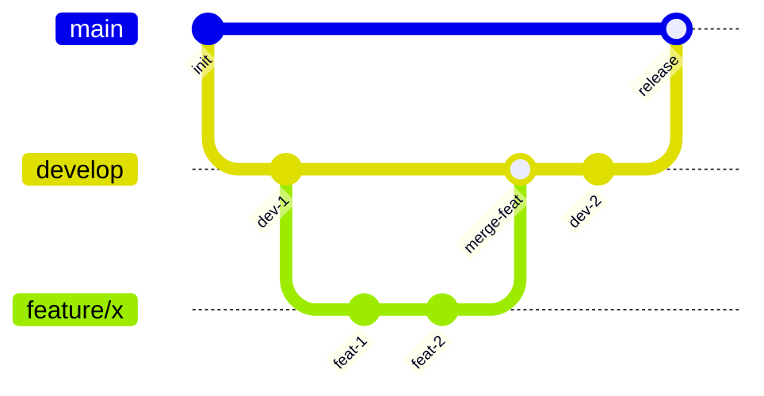
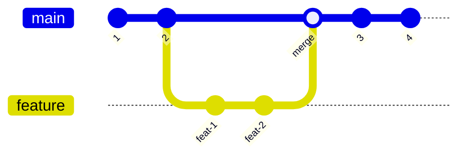
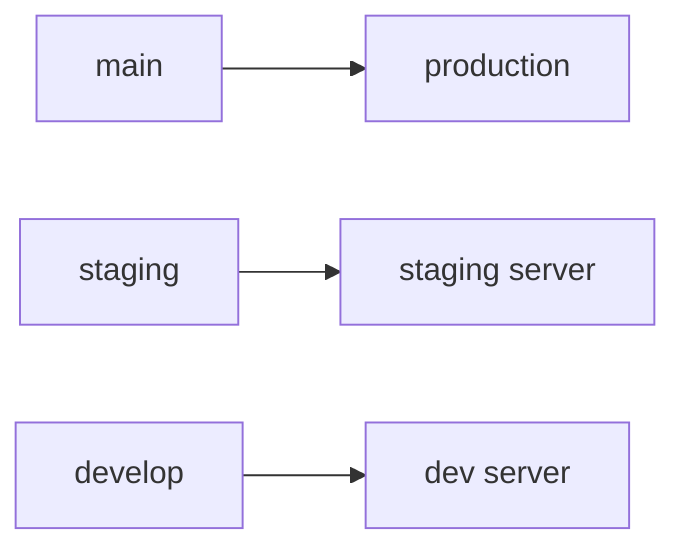

# Git for DevOps

The Git knowledge you need for deployment workflows, CI/CD, and server management.

## Essential Commands

```bash
# Clone a repo
git clone https://github.com/user/repo.git
git clone git@github.com:user/repo.git        # SSH (preferred)

# Check status
git status

# Stage and commit
git add file.txt                               # Stage a file
git add .                                      # Stage all changes
git commit -m "Add feature X"

# Push and pull
git push origin main
git pull origin main

# View history
git log --oneline
git log --oneline --graph --all                # Visual branch graph
```

## Branching Strategy

### Git Flow (Common for teams)



| Branch | Purpose |
|--------|---------|
| `main` | Production-ready code. Deploys trigger from here. |
| `develop` | Integration branch. Features merge here first. |
| `feature/*` | Individual feature work. Branch from and merge to `develop`. |
| `hotfix/*` | Emergency production fixes. Branch from `main`. |
| `release/*` | Prep for release. Branch from `develop`, merge to `main`. |

### Trunk-Based (Simpler, for smaller teams)



Everyone works on `main` or short-lived feature branches. Simpler but requires good CI/CD and tests.

## Branching for Deployments

### Branch per environment



CI/CD triggers based on which branch received a push:

```yaml
# GitHub Actions
on:
  push:
    branches:
      - main        # → deploy to production
      - staging     # → deploy to staging
```

### Tags for releases

```bash
# Create a tag
git tag v1.0.0
git tag -a v1.2.0 -m "Release 1.2.0"

# Push tags
git push origin v1.0.0
git push --tags                    # Push all tags

# List tags
git tag -l

# Delete a tag
git tag -d v1.0.0                  # Local
git push origin :v1.0.0            # Remote
```

CI/CD can trigger on tags:

```yaml
on:
  push:
    tags:
      - 'v*'     # Deploy when a version tag is pushed
```

## Git on the Server

### Setting up a repo on the server

```bash
# SSH into server
ssh deploy@server

# Clone the repo
git clone https://github.com/user/myapp.git /home/deploy/myapp

# Or with deploy key (SSH)
git clone git@github.com:user/myapp.git /home/deploy/myapp
```

### Pull-based deployment

The simplest deployment: SSH in and `git pull`.

```bash
cd /home/deploy/myapp
git pull origin main
npm install --production
sudo systemctl restart myapp
```

### Deploy keys

A deploy key is an SSH key that gives read-only (or read-write) access to a single repo.

```bash
# Generate on the server
ssh-keygen -t ed25519 -C "deploy-key-myapp" -f ~/.ssh/deploy_key -N ""

# Add the PUBLIC key to GitHub:
# Repo → Settings → Deploy keys → Add deploy key
cat ~/.ssh/deploy_key.pub

# Configure SSH to use this key for GitHub
cat >> ~/.ssh/config << 'EOF'
Host github.com
    IdentityFile ~/.ssh/deploy_key
    IdentitiesOnly yes
EOF

# Test
ssh -T git@github.com
# Hi user/myapp! You've successfully authenticated
```

## Git Hooks

Scripts that run automatically at certain Git events.

### Pre-commit hook (local)

Run linting/tests before allowing a commit:

```bash
# .git/hooks/pre-commit
#!/bin/sh
npm run lint
if [ $? -ne 0 ]; then
    echo "Lint failed. Fix errors before committing."
    exit 1
fi
```

```bash
chmod +x .git/hooks/pre-commit
```

### Post-receive hook (server-side deployment)

Set up a bare repo on the server that auto-deploys on push:

```bash
# On the server
mkdir -p /home/deploy/myapp.git
cd /home/deploy/myapp.git
git init --bare

# Create the hook
cat > hooks/post-receive << 'EOF'
#!/bin/bash
TARGET="/home/deploy/myapp"
GIT_DIR="/home/deploy/myapp.git"

echo "Deploying to $TARGET..."
git --work-tree=$TARGET --git-dir=$GIT_DIR checkout -f main

cd $TARGET
npm install --production
sudo systemctl restart myapp
echo "Deployment complete!"
EOF

chmod +x hooks/post-receive
```

```bash
# On your local machine — add the server as a remote
git remote add production deploy@server:/home/deploy/myapp.git

# Deploy by pushing
git push production main
```

## .gitignore for DevOps Projects

```
# Dependencies
node_modules/
vendor/
venv/
__pycache__/

# Environment files
.env
.env.local
.env.production
.env.*.local

# Build output
dist/
build/
target/
*.jar

# IDE
.vscode/
.idea/
*.swp

# OS
.DS_Store
Thumbs.db

# Logs
*.log

# Keys and certificates
*.pem
*.key
*.p12

# Docker
docker-compose.override.yml
```

## Useful Git Commands for DevOps

```bash
# See what changed in the last commit
git diff HEAD~1

# See what changed between branches
git diff main..feature-branch

# Find which commit introduced a bug
git bisect start
git bisect bad                     # Current commit is bad
git bisect good v1.0.0             # This version was good
# Git checks out middle commits, you test and mark good/bad

# See who changed each line of a file
git blame server.js

# Stash uncommitted changes (useful when you need to pull)
git stash
git pull origin main
git stash pop

# Cherry-pick a specific commit (e.g., apply a hotfix)
git cherry-pick abc123

# Reset to a specific commit (careful!)
git log --oneline                  # Find the commit
git revert abc123                  # Create a new commit that undoes abc123 (safe)

# View remote info
git remote -v

# Clean untracked files
git clean -n                       # Dry run (see what would be deleted)
git clean -f                       # Delete untracked files
```

## Commit Message Conventions

```
feat: add user authentication
fix: resolve database connection timeout
docs: update deployment guide
refactor: simplify error handling
chore: update dependencies
ci: add staging deployment workflow
```

Prefix with type → easier to read in `git log` and generate changelogs.

## Handling Secrets That Were Committed

If you accidentally committed a secret:

```bash
# 1. Immediately rotate the secret (change password/key/token)

# 2. Remove the file from tracking (but it's still in history)
git rm --cached .env
echo ".env" >> .gitignore
git commit -m "Remove .env from tracking"

# 3. To fully remove from history (rewrites history):
# Use git-filter-repo (recommended over filter-branch)
pip install git-filter-repo
git filter-repo --path .env --invert-paths

# 4. Force push (coordinate with your team)
git push --force
```

**The secret is compromised the moment it was pushed.** Always rotate it, even if you remove it from history. Someone may have already cloned the repo.

---

**Back to:** [Table of Contents](../README.md)
