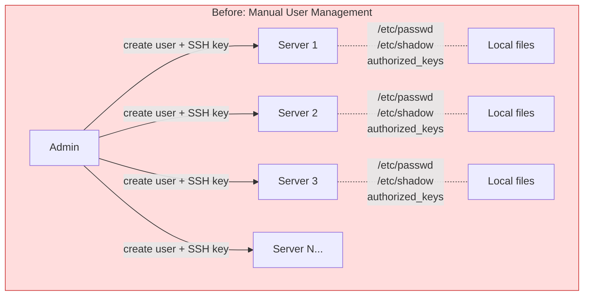
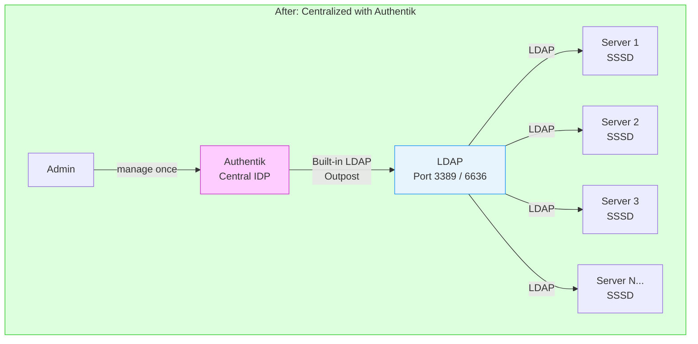
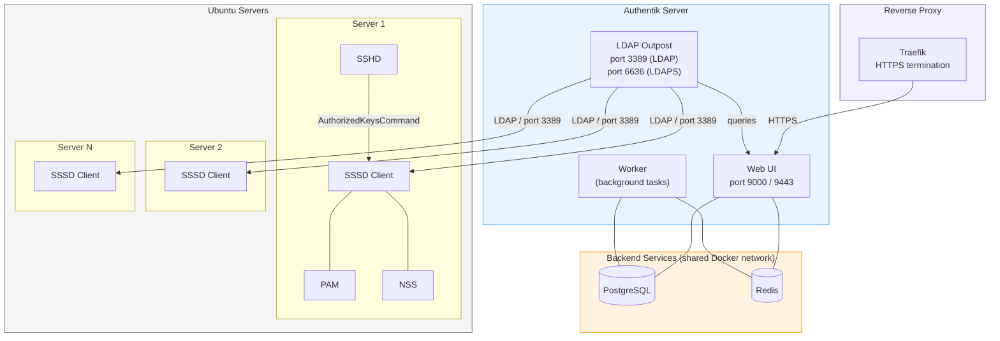
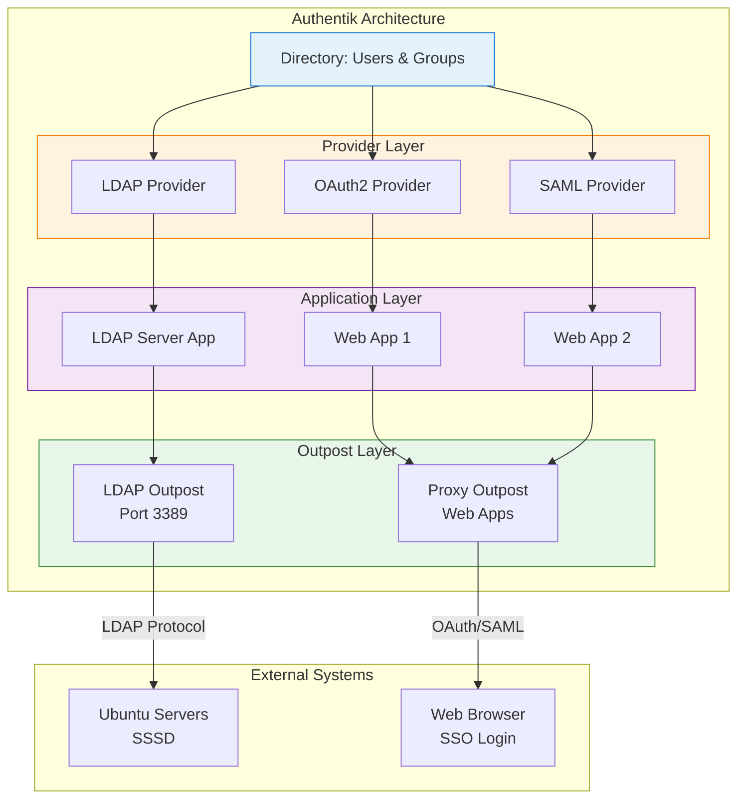
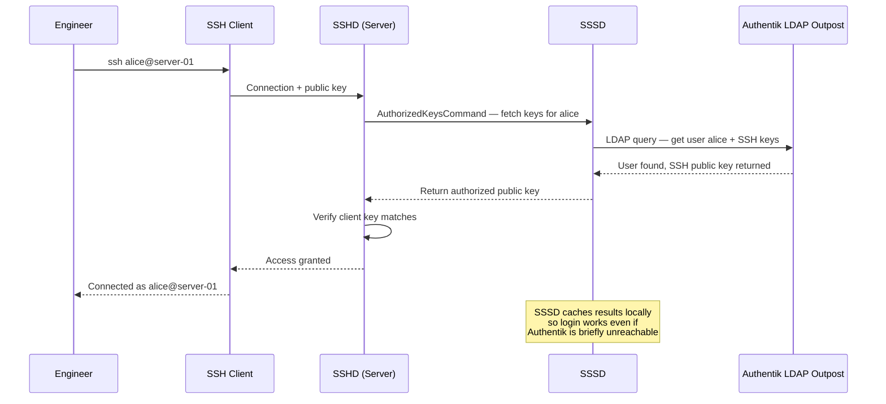
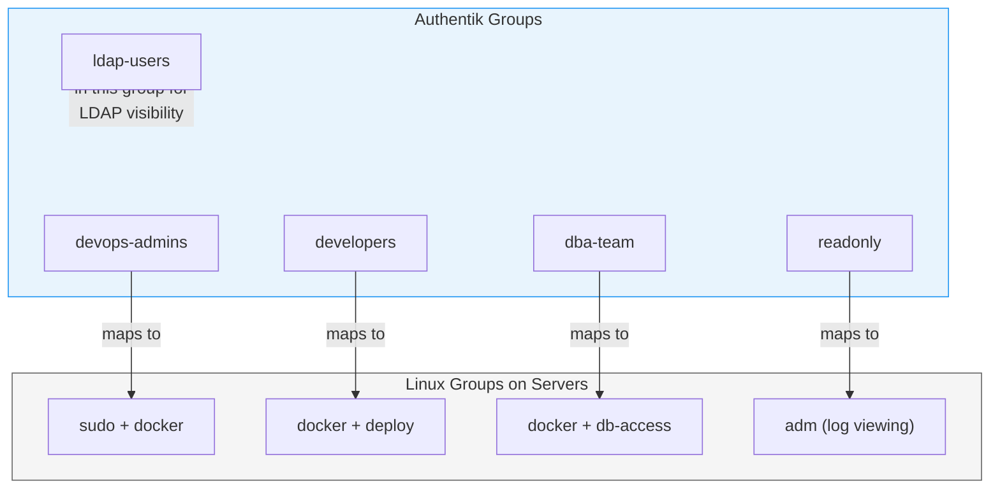
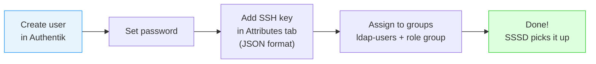
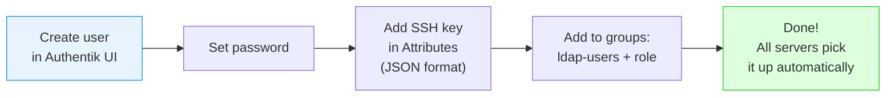
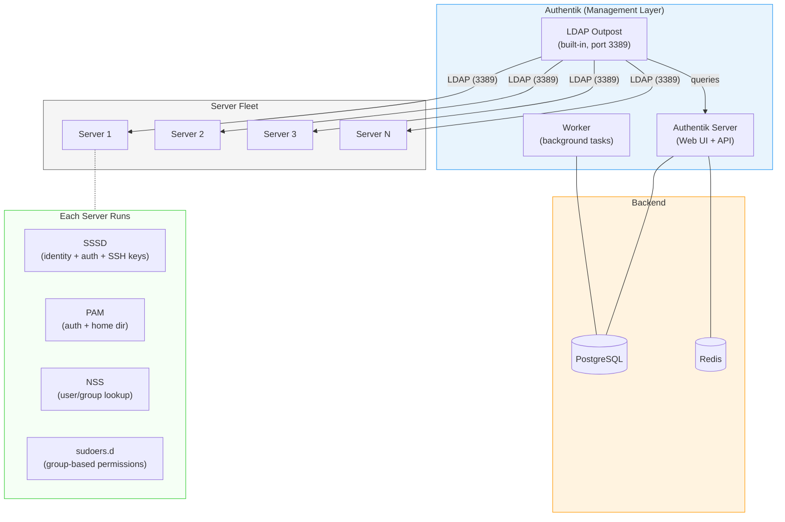

# Centralized Identity Management with Authentik

Managing users, passwords, SSH keys, and access across dozens of servers manually is a nightmare. This guide walks through setting up **Authentik as a central Identity Provider (IDP)** with its **built-in LDAP outpost** and connecting all Ubuntu servers via **SSSD** — so you manage users in one place and every server picks them up automatically.

---

## The Problem



**Pain points:**
- Adding a new team member = SSH into every server and create user manually
- Removing an employee = hope you remembered every server they had access to
- Password changes = nightmare across 20+ servers
- SSH key rotation = practically never happens
- No audit trail of who has access to what
- Group permissions are inconsistent across servers

---

## The Solution



**What this gives you:**
- Single place to create/disable users
- SSH public keys stored in Authentik, pulled by servers automatically
- Groups in Authentik map to Linux groups on every server
- Disable a user in Authentik = instantly locked out of all servers
- No separate OpenLDAP needed — Authentik has a built-in LDAP outpost

---

## Architecture Overview



### Authentik Internal Architecture

Authentik uses a layered model: **Directory** (users/groups) -> **Providers** (protocols) -> **Applications** (access points) -> **Outposts** (deployment endpoints).



For this guide, we only use the **LDAP Provider** -> **LDAP Server App** -> **LDAP Outpost** path. The other providers (OAuth2, SAML) are available if you later want SSO for web applications.

### How a Login Works (End to End)



---

## Part 1 — Setting Up Authentik

Authentik runs as three containers: **server**, **worker**, and **ldap**. It uses PostgreSQL and Redis as backends. If you already have these running (e.g., in a shared Docker network), Authentik connects to them directly.

### Prerequisites

- A dedicated server or VM (2 CPU, 4GB RAM minimum)
- Docker and Docker Compose installed ([Docker guide](../docker/introduction.md))
- A domain name pointing to this server (e.g., `authentik.yourcompany.com`)
- PostgreSQL and Redis already running (or deploy them alongside)
- Traefik (or another reverse proxy) for HTTPS

### Directory Structure

```bash
sudo mkdir -p /opt/authentik
cd /opt/authentik
```

### Docker Compose

```yaml
# /opt/authentik/docker-compose.yml
services:
  server:
    image: ghcr.io/goauthentik/server:latest
    container_name: authentik-server
    restart: unless-stopped
    command: server
    environment:
      AUTHENTIK_POSTGRESQL__HOST: ${PG_HOST}
      AUTHENTIK_POSTGRESQL__USER: ${PG_USER}
      AUTHENTIK_POSTGRESQL__PASSWORD: ${PG_PASS}
      AUTHENTIK_POSTGRESQL__NAME: ${PG_DB}
      AUTHENTIK_REDIS__HOST: ${REDIS_HOST}
      AUTHENTIK_REDIS__USERNAME: ${REDIS_USERNAME}
      AUTHENTIK_REDIS__PASSWORD: ${REDIS_PASSWORD}
      AUTHENTIK_SECRET_KEY: ${AUTHENTIK_SECRET_KEY}
    ports:
      - "9000:9000"
      - "9443:9443"
    volumes:
      - authentik_media:/media
      - authentik_templates:/templates
    networks:
      - shared-net

  worker:
    image: ghcr.io/goauthentik/server:latest
    container_name: authentik-worker
    restart: unless-stopped
    command: worker
    environment:
      AUTHENTIK_POSTGRESQL__HOST: ${PG_HOST}
      AUTHENTIK_POSTGRESQL__USER: ${PG_USER}
      AUTHENTIK_POSTGRESQL__PASSWORD: ${PG_PASS}
      AUTHENTIK_POSTGRESQL__NAME: ${PG_DB}
      AUTHENTIK_REDIS__HOST: ${REDIS_HOST}
      AUTHENTIK_REDIS__USERNAME: ${REDIS_USERNAME}
      AUTHENTIK_REDIS__PASSWORD: ${REDIS_PASSWORD}
      AUTHENTIK_SECRET_KEY: ${AUTHENTIK_SECRET_KEY}
    volumes:
      - authentik_media:/media
      - authentik_templates:/templates
    networks:
      - shared-net

  ldap:
    image: ghcr.io/goauthentik/ldap:latest
    container_name: authentik-ldap
    restart: unless-stopped
    environment:
      AUTHENTIK_HOST: http://authentik-server:9000
      AUTHENTIK_INSECURE: "true"
      AUTHENTIK_TOKEN: ${AUTHENTIK_LDAP_TOKEN}
    ports:
      - "3389:3389"
      - "6636:6636"
    networks:
      - shared-net

volumes:
  authentik_media:
  authentik_templates:

networks:
  shared-net:
    external: true
```

> **Note:** The `shared-net` network is an existing Docker network where your PostgreSQL and Redis containers are already running. Create it with `docker network create shared-net` if it doesn't exist, and attach your database containers to it.

### Environment File

```bash
# /opt/authentik/.env

# PostgreSQL (existing instance on shared network)
PG_HOST=postgres
PG_USER=authentik
PG_PASS=your-strong-database-password
PG_DB=authentik

# Redis (existing instance on shared network)
REDIS_HOST=redis
REDIS_USERNAME=authentik-app
REDIS_PASSWORD=your-strong-redis-password

# Authentik secret key (generate with: openssl rand -base64 60)
AUTHENTIK_SECRET_KEY=your-60-character-generated-secret-key-here

# LDAP outpost token (get this from Authentik UI after creating the outpost)
# Leave empty on first deploy, fill in after Part 2
AUTHENTIK_LDAP_TOKEN=
```

```bash
# Protect the env file
chmod 600 /opt/authentik/.env
```

### Generate the Secret Key

```bash
# Generate a 60-character secret key
openssl rand -base64 60
```

Copy the output into your `.env` file as `AUTHENTIK_SECRET_KEY`.

### Fix: Redis ACL Permissions

If your Redis instance uses ACL-based authentication (common with shared Redis), the default restricted ACL will break Authentik. Authentik needs full access to Redis commands.

**Symptoms:** Authentik server/worker crash-loops with Redis permission errors in logs.

**Solution:** Grant full permissions to the Authentik Redis user:

```bash
# Connect to Redis and update ACL
docker exec redis redis-cli ACL SETUSER authentik-app on ">your-strong-redis-password" "~*" "&*" "+@all"

# Or if you use an ACL file (/etc/redis/users.acl), add this line:
# user authentik-app on >your-strong-redis-password ~* &* +@all

# Reload ACL from file
docker exec redis redis-cli ACL LOAD
```

### Start Authentik (First Deploy)

On the first deploy, start only the server and worker (not the LDAP outpost — we need the token first):

```bash
cd /opt/authentik

# Start server and worker only
docker compose up -d server worker

# Check logs
docker compose logs -f server
```

Once you see the server is running, proceed to Part 2 to configure Authentik and get the LDAP outpost token.

---

## Part 2 — Configuring Authentik

### Step 1 — Initial Setup

1. Open `https://authentik.yourcompany.com/if/flow/initial-setup/`
2. Create your admin account (username, email, password)
3. Log in to the admin interface at `https://authentik.yourcompany.com/if/admin/`

### Step 2 — Create Groups

Create groups first since you'll assign users to them.

1. Go to **Directory** -> **Groups** -> **Create**
2. Create each group:
   - `ldap-users` — All users who should be visible via LDAP
   - `devops-admins` — Full sudo access, Docker, everything
   - `developers` — Docker, deploy access, no sudo
   - `dba-team` — Database access, Docker
   - `readonly` — Can SSH in, view logs, nothing else



### Step 3 — Create LDAP Provider

1. Go to **Applications** -> **Providers** -> **Create**
2. Select **LDAP Provider**
3. Configure:
   - **Name:** `LDAP for Servers`
   - **Base DN:** `dc=yourcompany,dc=com`
   - Keep all other defaults
4. Click **Finish**

### Step 4 — Create Application

1. Go to **Applications** -> **Applications** -> **Create**
2. Configure:
   - **Name:** `LDAP Server`
   - **Slug:** `ldap-server`
   - **Provider:** Select `LDAP for Servers`
3. Click **Create**

### Step 5 — Create LDAP Outpost and Get Token

1. Go to **Applications** -> **Outposts** -> **Create**
2. Configure:
   - **Name:** `LDAP Outpost`
   - **Type:** LDAP
   - **Applications:** Select `LDAP Server`
3. Click **Create**
4. Click on the newly created outpost -> **View deployment info**
5. **Copy the token** — this is your `AUTHENTIK_LDAP_TOKEN`

Now update your `.env` file with the token and start the LDAP container:

```bash
# Edit .env and paste the token
nano /opt/authentik/.env
# Set: AUTHENTIK_LDAP_TOKEN=<paste-token-here>

# Start all services including LDAP
cd /opt/authentik
docker compose down && docker compose up -d

# Verify LDAP outpost is running
docker compose logs -f ldap
```

### Step 6 — Create Service Account for SSSD

Servers need a read-only account to query LDAP. Create a service account:

1. Go to **Directory** -> **Users** -> **Create**
2. Configure:
   - **Username:** `ldap-readonly`
   - **Name:** `LDAP Service Account`
   - **User type:** Service Account
3. Click **Create**
4. Set a strong password for this user (save it — you'll need it for SSSD config on every server)
5. Add `ldap-readonly` to the `ldap-users` group

**Grant LDAP read permissions:**
1. Go to **Applications** -> **Providers** -> select `LDAP for Servers`
2. Go to the **Permissions** tab
3. **Assign** the `ldap-readonly` user full LDAP read access

### Step 7 — Create Users

For each team member:

1. Go to **Directory** -> **Users** -> **Create**
2. Fill in:
   - **Username:** `alice`
   - **Email:** `alice@yourcompany.com`
   - **Name:** `Alice Engineer`
3. Click **Create**
4. Set a password for the user
5. Go to the **Attributes** tab and add the SSH public key as JSON:

```json
{
  "sshPublicKey": "ssh-ed25519 AAAAC3NzaC1lZDI1NTE5AAAAIG... alice@laptop"
}
```

6. Go to the **Groups** tab and assign to:
   - `ldap-users` (required for LDAP visibility)
   - `developers` (or whichever role group applies)



### Verify LDAP Is Working

From your Authentik server (or any machine that can reach port 3389):

```bash
# Test LDAP search
ldapsearch -x \
  -H ldap://localhost:3389 \
  -b "dc=yourcompany,dc=com" \
  -D "cn=ldap-readonly,ou=users,dc=yourcompany,dc=com" \
  -w "ldap-readonly-password" \
  "(objectClass=user)"
```

You should see your users listed. If this fails, check:
- LDAP outpost container is running: `docker compose logs ldap`
- Token is correct in `.env`
- `ldap-readonly` user has LDAP read permissions on the provider

---

## Part 3 — Configuring Ubuntu Servers (SSSD + LDAP)

This is the configuration that goes on **every Ubuntu server** you want to centrally manage.

### Install Required Packages

```bash
sudo apt update
sudo apt install -y \
  sssd \
  sssd-ldap \
  sssd-tools \
  ldap-utils \
  libpam-sss \
  libnss-sss
```

| Package | Purpose |
|---------|---------|
| `sssd` | Core daemon for identity/auth |
| `sssd-ldap` | LDAP provider for SSSD |
| `sssd-tools` | CLI tools for SSSD management |
| `ldap-utils` | `ldapsearch` for testing |
| `libpam-sss` | PAM module — SSSD handles login auth |
| `libnss-sss` | NSS module — SSSD resolves user/group lookups |

### Test LDAP Connectivity

Before configuring SSSD, verify you can reach Authentik's LDAP outpost:

```bash
ldapsearch -x \
  -H ldap://authentik-server-ip:3389 \
  -b "dc=yourcompany,dc=com" \
  -D "cn=ldap-readonly,ou=users,dc=yourcompany,dc=com" \
  -w "ldap-readonly-password" \
  "(objectClass=user)"
```

You should see your users. If this fails, check firewall rules and network connectivity first.

### Configure SSSD

```bash
sudo nano /etc/sssd/sssd.conf
```

```ini
[sssd]
services = nss, pam, ssh
config_file_version = 2
domains = yourcompany.com

[domain/yourcompany.com]
# Identity provider
id_provider = ldap
auth_provider = ldap
chpass_provider = ldap

# LDAP connection — Authentik LDAP outpost
# Use port 3389 for LDAP, 6636 for LDAPS
ldap_uri = ldap://authentik-server-ip:3389
ldap_search_base = dc=yourcompany,dc=com

# Service account for LDAP queries
ldap_default_bind_dn = cn=ldap-readonly,ou=users,dc=yourcompany,dc=com
ldap_default_authtok_type = password
ldap_default_authtok = ldap-readonly-password

# No TLS for port 3389 (use port 6636 + ldaps:// for production)
ldap_id_use_start_tls = false

# User settings — Authentik uses cn (not uid) for usernames
ldap_user_search_base = ou=users,dc=yourcompany,dc=com
ldap_user_object_class = user
ldap_user_name = cn
ldap_user_uid_number = uidNumber
ldap_user_gid_number = gidNumber
ldap_user_home_directory = homeDirectory
ldap_user_shell = loginShell
ldap_user_ssh_public_key = sshPublicKey

# Group settings
ldap_group_search_base = ou=groups,dc=yourcompany,dc=com
ldap_group_object_class = group
ldap_group_name = cn
ldap_group_gid_number = gidNumber
ldap_group_member = member

# Caching (so login works even if Authentik is briefly down)
cache_credentials = true
entry_cache_timeout = 300
ldap_purge_cache_timeout = 600

# Access control — only allow users in these groups
access_provider = simple
simple_allow_groups = devops-admins, developers, dba-team, readonly

# Auto-create home directory on first login
override_homedir = /home/%u
default_shell = /bin/bash

# Enumeration (set to true if you want getent passwd to list all LDAP users)
enumerate = false

[nss]
filter_groups = root
filter_users = root

[pam]

[ssh]
```

> **Important:** Authentik uses `cn` for usernames, not `uid`. This is different from a traditional OpenLDAP setup. Make sure `ldap_user_name = cn` is set.

### Lock Down Permissions

```bash
sudo chmod 600 /etc/sssd/sssd.conf
sudo chown root:root /etc/sssd/sssd.conf
```

SSSD will refuse to start if the config file permissions are not `600`.

### Configure NSS (Name Service Switch)

Edit `/etc/nsswitch.conf` to tell the system to look up users and groups from SSSD:

```bash
sudo nano /etc/nsswitch.conf
```

Update these lines:

```
passwd:     files sss
group:      files sss
shadow:     files sss
```

This means: look in local files first (`/etc/passwd`, `/etc/group`), then ask SSSD.

### Configure PAM for Auto Home Directory Creation

```bash
sudo pam-auth-update --enable mkhomedir
```

This ensures that when a user from LDAP logs in for the first time, their home directory is automatically created.

### Configure SSHD to Fetch Keys from LDAP

Edit the SSH daemon config:

```bash
sudo nano /etc/ssh/sshd_config
```

Add or modify these lines:

```
# Fetch SSH keys from LDAP via SSSD
AuthorizedKeysCommand /usr/bin/sss_ssh_authorizedkeys
AuthorizedKeysCommandUser nobody

# Keep local authorized_keys as fallback (for emergency access)
AuthorizedKeysFile .ssh/authorized_keys
```

| Setting | What it does |
|---------|--------------|
| `AuthorizedKeysCommand` | Script/binary SSHD runs to fetch public keys for a user |
| `AuthorizedKeysCommandUser` | OS user that runs the command (use `nobody` for least privilege) |
| `AuthorizedKeysFile` | Still checks local keys as a fallback |

### Validate and Restart Services

```bash
# Validate SSHD config syntax
sudo sshd -t

# Enable and start SSSD
sudo systemctl enable sssd
sudo systemctl restart sssd

# Restart SSH (on Ubuntu the service is called 'ssh', not 'sshd')
sudo systemctl restart ssh
```

### Verify Everything Works

```bash
# Check user resolution from LDAP
getent passwd alice
# alice:*:10001:10001:Alice Engineer:/home/alice:/bin/bash

# Check group resolution
getent group developers

# Check user's groups
id alice

# Check SSH key fetch
sudo /usr/bin/sss_ssh_authorizedkeys alice
# Should output: ssh-ed25519 AAAAC3NzaC1lZDI1NTE5AAAAIG... alice@laptop

# Verify SSHD is using AuthorizedKeysCommand
sudo sshd -T | grep authorizedkeyscommand
```

### Emergency Local Access

Always maintain a local admin account with a local SSH key in case Authentik goes down:

```bash
sudo adduser emergency-admin
sudo usermod -aG sudo emergency-admin
sudo mkdir -p /home/emergency-admin/.ssh
# Add your emergency SSH key to authorized_keys
sudo chmod 700 /home/emergency-admin/.ssh
sudo chmod 600 /home/emergency-admin/.ssh/authorized_keys
sudo chown -R emergency-admin:emergency-admin /home/emergency-admin/.ssh
```

> **Critical:** Store the emergency admin SSH key securely (password manager, hardware key, etc.). This is your break-glass account.

---

## Part 4 — Adding a New Server to the Network

Use this automation script to bootstrap any new Ubuntu server. It installs SSSD, configures LDAP, sets up SSH key fetching, and configures group-based access — all in one run.

### Bootstrap Script

```bash
#!/bin/bash
# setup-centralized-auth.sh
# Run on a fresh Ubuntu server to connect it to Authentik LDAP
# Usage: sudo ./setup-centralized-auth.sh

set -euo pipefail

# ============================================================
# CONFIGURATION — Update these for your environment
# ============================================================
LDAP_URI="ldap://authentik-server-ip:3389"
LDAP_BASE_DN="dc=yourcompany,dc=com"
LDAP_BIND_DN="cn=ldap-readonly,ou=users,dc=yourcompany,dc=com"
LDAP_BIND_PASSWORD="ldap-readonly-password"
LDAP_USER_BASE="ou=users,${LDAP_BASE_DN}"
LDAP_GROUP_BASE="ou=groups,${LDAP_BASE_DN}"
ALLOWED_GROUPS="devops-admins, developers, dba-team, readonly"
EMERGENCY_USER="emergency-admin"
EMERGENCY_SSH_KEY="ssh-ed25519 AAAA... emergency@yourcompany.com"
# ============================================================

echo "=== Installing packages ==="
apt update
apt install -y sssd sssd-ldap sssd-tools ldap-utils \
  libpam-sss libnss-sss

echo "=== Writing SSSD config ==="
cat > /etc/sssd/sssd.conf << SSSD_EOF
[sssd]
services = nss, pam, ssh
config_file_version = 2
domains = yourcompany.com

[domain/yourcompany.com]
id_provider = ldap
auth_provider = ldap
chpass_provider = ldap

ldap_uri = ${LDAP_URI}
ldap_search_base = ${LDAP_BASE_DN}
ldap_default_bind_dn = ${LDAP_BIND_DN}
ldap_default_authtok_type = password
ldap_default_authtok = ${LDAP_BIND_PASSWORD}

ldap_id_use_start_tls = false

ldap_user_search_base = ${LDAP_USER_BASE}
ldap_user_object_class = user
ldap_user_name = cn
ldap_user_uid_number = uidNumber
ldap_user_gid_number = gidNumber
ldap_user_home_directory = homeDirectory
ldap_user_shell = loginShell
ldap_user_ssh_public_key = sshPublicKey

ldap_group_search_base = ${LDAP_GROUP_BASE}
ldap_group_object_class = group
ldap_group_name = cn
ldap_group_gid_number = gidNumber
ldap_group_member = member

cache_credentials = true
entry_cache_timeout = 300
enumerate = false

access_provider = simple
simple_allow_groups = ${ALLOWED_GROUPS}

override_homedir = /home/%u
default_shell = /bin/bash

[nss]
filter_groups = root
filter_users = root

[pam]

[ssh]
SSSD_EOF

chmod 600 /etc/sssd/sssd.conf
chown root:root /etc/sssd/sssd.conf

echo "=== Configuring NSS ==="
sed -i 's/^passwd:.*/passwd:     files sss/' /etc/nsswitch.conf
sed -i 's/^group:.*/group:      files sss/' /etc/nsswitch.conf
sed -i 's/^shadow:.*/shadow:     files sss/' /etc/nsswitch.conf

echo "=== Configuring PAM for auto home directory ==="
pam-auth-update --enable mkhomedir

echo "=== Configuring SSHD ==="
if ! grep -q "AuthorizedKeysCommand /usr/bin/sss_ssh_authorizedkeys" /etc/ssh/sshd_config; then
    cat >> /etc/ssh/sshd_config << 'SSH_EOF'

# Fetch SSH keys from LDAP via SSSD
AuthorizedKeysCommand /usr/bin/sss_ssh_authorizedkeys
AuthorizedKeysCommandUser nobody
SSH_EOF
fi

echo "=== Configuring sudoers ==="
cat > /etc/sudoers.d/devops-admins << 'EOF'
%devops-admins ALL=(ALL:ALL) ALL
EOF
chmod 440 /etc/sudoers.d/devops-admins

cat > /etc/sudoers.d/developers << 'EOF'
%developers ALL=(ALL) NOPASSWD: /usr/bin/systemctl restart myapp*, \
                                /usr/bin/systemctl reload nginx, \
                                /usr/bin/systemctl status *
EOF
chmod 440 /etc/sudoers.d/developers

echo "=== Creating emergency admin account ==="
if ! id "$EMERGENCY_USER" &>/dev/null; then
    adduser --disabled-password --gecos "Emergency Admin" "$EMERGENCY_USER"
    usermod -aG sudo "$EMERGENCY_USER"
    mkdir -p /home/${EMERGENCY_USER}/.ssh
    echo "$EMERGENCY_SSH_KEY" > /home/${EMERGENCY_USER}/.ssh/authorized_keys
    chown -R ${EMERGENCY_USER}:${EMERGENCY_USER} /home/${EMERGENCY_USER}/.ssh
    chmod 700 /home/${EMERGENCY_USER}/.ssh
    chmod 600 /home/${EMERGENCY_USER}/.ssh/authorized_keys
fi

echo "=== Starting services ==="
systemctl enable sssd
systemctl restart sssd
sshd -t && systemctl restart ssh

echo ""
echo "=== Setup complete ==="
echo "Test with: getent passwd <ldap-username>"
echo "Test SSH:  ssh <ldap-username>@$(hostname -I | awk '{print $1}')"
```

```bash
chmod 700 setup-centralized-auth.sh
sudo ./setup-centralized-auth.sh
```

---

## Part 5 — Day-to-Day Operations

### Adding a New User



1. **Authentik UI** -> Directory -> Users -> Create
2. Set username, email, name, password
3. **Attributes tab** -> Add SSH key as JSON:
   ```json
   {
     "sshPublicKey": "ssh-ed25519 AAAA... user@laptop"
   }
   ```
4. **Groups tab** -> Assign to `ldap-users` + their role group (e.g., `developers`)
5. **That's it.** SSSD on every server will pick up the new user automatically (within the cache timeout — 5 minutes by default).

### Removing a User

1. **Authentik UI** -> Directory -> Users -> Select user -> **Disable**
2. All servers will stop authenticating them within the cache timeout.

For **immediate** revocation on critical servers:

```bash
sudo sss_cache -E
sudo systemctl restart sssd
```

### Rotating SSH Keys

1. User generates a new key pair locally
2. In Authentik: update their `sshPublicKey` in the Attributes tab
3. Done — all servers pick up the new key automatically

### Checking Who Has Access

```bash
# On any server — list group members
getent group devops-admins
getent group developers

# Check a specific user
id alice

# Check SSSD status
sudo sssctl domain-status yourcompany.com

# Fetch SSH keys for a user
sudo sss_ssh_authorizedkeys alice
```

---

## Part 6 — Group-Based Access Control

### Access Matrix

| Authentik Group | Linux Permissions | Can sudo | Docker | Deploy | View Logs |
|----------------|-------------------|----------|--------|--------|-----------|
| `devops-admins` | `sudo`, `docker` | Yes (full) | Yes | Yes | Yes |
| `developers` | `docker`, `deploy` | Limited | Yes | Yes | Yes |
| `dba-team` | `docker`, `db-access` | Limited | Yes | No | Yes |
| `readonly` | `adm` | No | No | No | Yes |

### Sudoers Configuration

These are set up by the bootstrap script (Part 4), but here's what goes where:

```bash
# /etc/sudoers.d/devops-admins
%devops-admins ALL=(ALL:ALL) ALL
```

```bash
# /etc/sudoers.d/developers
%developers ALL=(ALL) NOPASSWD: /usr/bin/systemctl restart myapp*, \
                                /usr/bin/systemctl reload nginx, \
                                /usr/bin/systemctl status *
```

### Supplementary Group Mapping

Use `/etc/security/group.conf` for PAM-based group assignment:

```
# /etc/security/group.conf
*;*;%devops-admins;Al0000-2400;docker,sudo
*;*;%developers;Al0000-2400;docker,deploy
*;*;%dba-team;Al0000-2400;docker,db-access
*;*;%readonly;Al0000-2400;adm
```

Enable `pam_group` in PAM:

```bash
# Add to /etc/pam.d/common-auth (after pam_sss.so line)
auth optional pam_group.so
```

---

## Part 7 — Troubleshooting

### LDAP Outpost Keeps Restarting

```bash
# Check logs
docker compose logs ldap

# Most common cause: wrong token
# Fix: Go to Authentik UI → Outposts → View deployment info → Copy token
# Update .env with correct AUTHENTIK_LDAP_TOKEN
# Restart properly (not just restart — full down/up):
docker compose down && docker compose up -d
```

### Redis Permission Errors in Authentik Logs

Authentik needs full Redis access. Default restricted ACLs break it.

```bash
# Fix: grant full permissions
docker exec redis redis-cli ACL SETUSER authentik-app on ">PASSWORD" "~*" "&*" "+@all"
docker exec redis redis-cli ACL LOAD
```

### User Not Appearing in LDAP Search

1. Check the user is in the `ldap-users` group in Authentik
2. Check `ldap-readonly` has "full LDAP read access" on the Provider's Permissions tab
3. Restart the LDAP outpost: `docker compose restart ldap`

### `getent passwd username` Returns Nothing

```bash
# Check SSSD is running
sudo systemctl status sssd

# Check SSSD logs (increase verbosity if needed)
# Add debug_level = 6 under [domain/yourcompany.com] in sssd.conf
sudo journalctl -u sssd -f

# Clear cache and restart
sudo sss_cache -E
sudo systemctl restart sssd

# Test LDAP directly (bypasses SSSD)
ldapsearch -x \
  -H ldap://authentik-server-ip:3389 \
  -b "dc=yourcompany,dc=com" \
  -D "cn=ldap-readonly,ou=users,dc=yourcompany,dc=com" \
  -w "password" \
  "(objectClass=user)"
```

### SSH Asks for Password Instead of Using Key

```bash
# 1. Check if the key is being fetched
sudo /usr/bin/sss_ssh_authorizedkeys alice
# Should output the SSH public key

# 2. Verify SSHD config
sudo sshd -T | grep authorizedkeyscommand
# Should show: authorizedkeyscommand /usr/bin/sss_ssh_authorizedkeys

# 3. Restart SSH (Ubuntu uses 'ssh' not 'sshd')
sudo systemctl restart ssh

# 4. Test with verbose SSH from client side
ssh -vvv alice@server-ip
```

### Common Errors Quick Reference

| Error | Cause | Fix |
|-------|-------|-----|
| `getent passwd alice` returns nothing | SSSD not running or misconfigured | Check `systemctl status sssd` and logs |
| `sss_ssh_authorizedkeys` returns empty | SSH key not in user attributes or user not in `ldap-users` group | Check Authentik user attributes and group membership |
| `Permission denied (publickey)` | Key mismatch or SSHD not using AuthorizedKeysCommand | Check `sshd -T` output, restart ssh |
| LDAP outpost keeps restarting | Wrong `AUTHENTIK_LDAP_TOKEN` | Re-copy token from Authentik UI, full restart |
| Redis errors in Authentik logs | Restricted Redis ACL | Grant full ACL permissions (see above) |
| Home directory not created | `mkhomedir` PAM module not enabled | Run `pam-auth-update --enable mkhomedir` |
| User can SSH but no sudo | sudoers file missing or wrong group | Check `/etc/sudoers.d/` files |

---

## Backup Strategy

```bash
# Backup Authentik database
docker exec postgres pg_dump -U authentik authentik > /backup/authentik-db-$(date +%Y%m%d).sql

# Backup Authentik media (custom branding, icons, etc.)
docker cp authentik-server:/media /backup/authentik-media-$(date +%Y%m%d)

# Backup SSSD config (from each server)
cp /etc/sssd/sssd.conf /backup/sssd-$(hostname)-$(date +%Y%m%d).conf
```

---

## Quick Reference

### Server-Side Commands

```bash
# Check if a user exists (resolves from LDAP)
getent passwd alice

# Check user's groups
id alice

# Fetch SSH keys for a user
sudo /usr/bin/sss_ssh_authorizedkeys alice

# Clear SSSD cache
sudo sss_cache -E

# Restart SSSD
sudo systemctl restart sssd

# Restart SSH
sudo systemctl restart ssh

# Check SSHD config
sudo sshd -T | grep authorizedkeyscommand

# Check SSSD status
sudo sssctl domain-status yourcompany.com
```

### Authentik Admin Operations

| Task | Where |
|------|-------|
| Create user | Directory -> Users -> Create |
| Add SSH key | Directory -> Users -> select user -> Attributes -> add `sshPublicKey` JSON |
| Assign group | Directory -> Users -> select user -> Groups -> Add |
| Disable user | Directory -> Users -> select user -> toggle Active off |
| Create group | Directory -> Groups -> Create |
| Manage LDAP provider | Applications -> Providers -> select provider |
| View outpost status | Applications -> Outposts |
| Get outpost token | Applications -> Outposts -> select -> View deployment info |

### Architecture Recap



---

**Related guides:**
- [Ubuntu Server Setup](../server-setup/ubuntu-server-setup.md) — Initial server configuration
- [SSH](../ssh/ssh.md) — SSH fundamentals and hardening
- [Server Hardening](../security/server-hardening.md) — Firewall, fail2ban, security headers
- [Users, Groups & Permissions](../linux-fundamentals/users-and-permissions.md) — Linux user management basics
- [Docker Compose](../docker/compose.md) — Running multi-container setups
