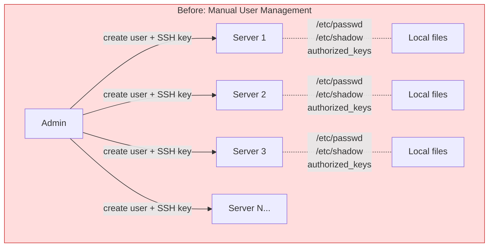
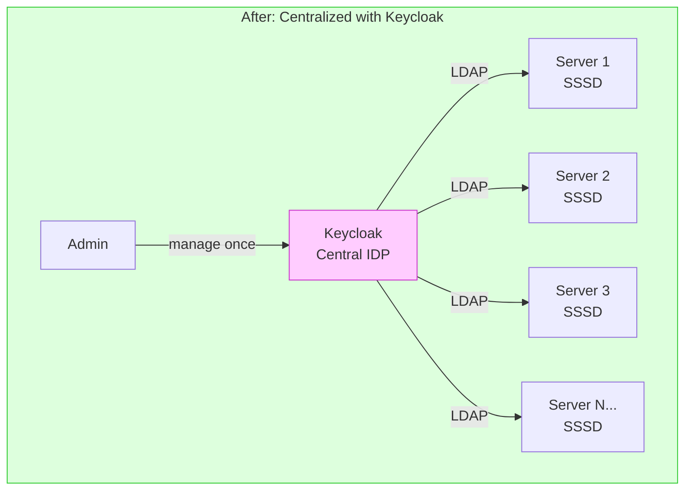
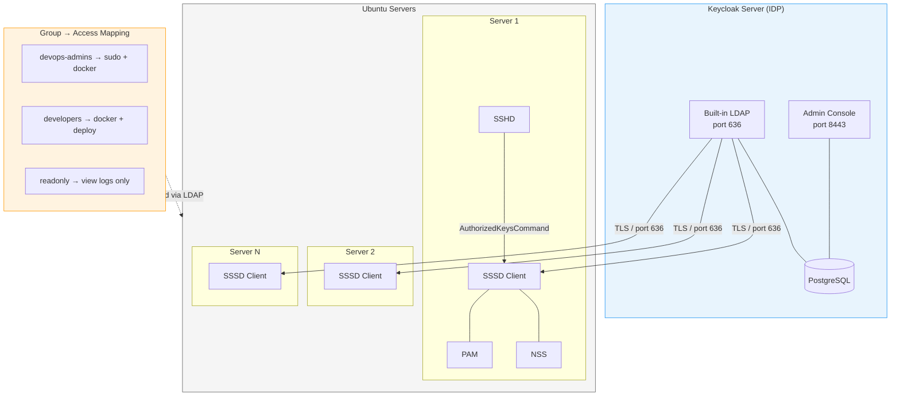
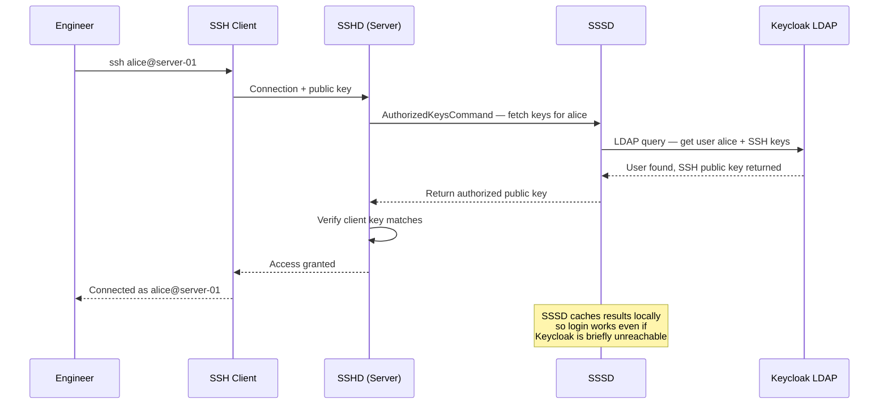
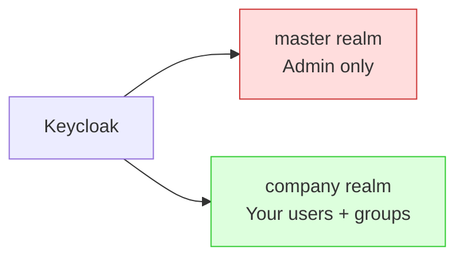
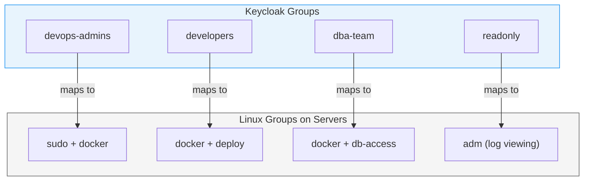
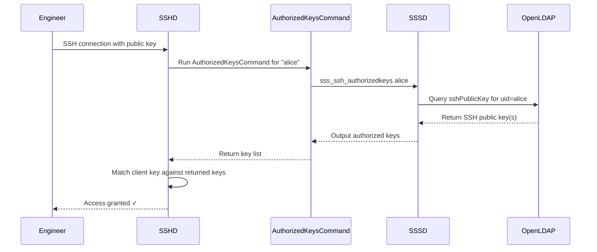
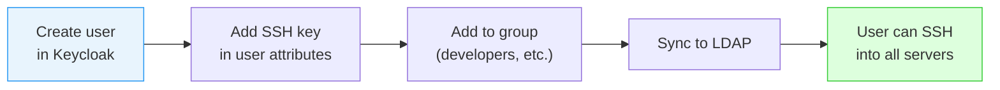
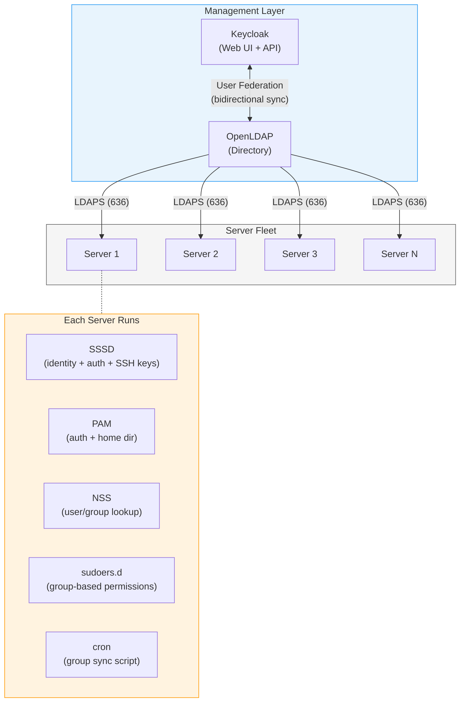

# Centralized Identity Management with Keycloak

Managing users, passwords, SSH keys, and access across dozens of servers manually is a nightmare. This guide walks through setting up **Keycloak as a central Identity Provider (IDP)** and connecting all Ubuntu servers via **LDAP** — so you manage users in one place and every server picks them up automatically.

---

## The Problem



**Pain points:**
- Adding a new team member = SSH into every server and create user manually
- Removing an employee = hope you remembered every server they had access to
- Password changes = nightmare across 20+ servers
- SSH key rotation = practically never happens
- No audit trail of who has access to what
- Group permissions are inconsistent across servers

---

## The Solution



**What this gives you:**
- Single place to create/disable users
- SSH public keys stored in Keycloak, pulled by servers automatically
- Groups in Keycloak map to Linux groups on every server
- Disable a user in Keycloak = instantly locked out of all servers
- Full audit trail via Keycloak's event logging

---

## Architecture Overview



### How a Login Works (End to End)



---

## Part 1 — Setting Up Keycloak

We'll run Keycloak with Docker Compose on a dedicated server (or alongside your other infra). This setup uses PostgreSQL as the database and Nginx as a reverse proxy with TLS.

### Prerequisites

- A dedicated server or VM (2 CPU, 4GB RAM minimum)
- Docker and Docker Compose installed ([Docker guide](../docker/introduction.md))
- A domain name pointing to this server (e.g., `idp.yourcompany.com`)
- TLS certificate (use Certbot — see [SSL/TLS guide](../nginx/ssl-tls.md))

### Directory Structure

```bash
sudo mkdir -p /opt/keycloak
cd /opt/keycloak
```

### Docker Compose

```yaml
# /opt/keycloak/docker-compose.yml
services:
  postgres:
    image: postgres:16-alpine
    container_name: keycloak-db
    restart: unless-stopped
    environment:
      POSTGRES_DB: keycloak
      POSTGRES_USER: keycloak
      POSTGRES_PASSWORD: ${DB_PASSWORD}
    volumes:
      - pgdata:/var/lib/postgresql/data
    networks:
      - keycloak-net
    healthcheck:
      test: ["CMD-SHELL", "pg_isready -U keycloak"]
      interval: 10s
      timeout: 5s
      retries: 5

  keycloak:
    image: quay.io/keycloak/keycloak:26.0
    container_name: keycloak
    restart: unless-stopped
    command: start
    environment:
      # Database
      KC_DB: postgres
      KC_DB_URL: jdbc:postgresql://postgres:5432/keycloak
      KC_DB_USERNAME: keycloak
      KC_DB_PASSWORD: ${DB_PASSWORD}

      # Admin credentials
      KC_BOOTSTRAP_ADMIN_USERNAME: ${KC_ADMIN_USER}
      KC_BOOTSTRAP_ADMIN_PASSWORD: ${KC_ADMIN_PASSWORD}

      # Proxy settings (behind Nginx)
      KC_PROXY_HEADERS: xforwarded
      KC_HTTP_ENABLED: "true"
      KC_HOSTNAME: idp.yourcompany.com

      # Enable LDAP server (Keycloak's built-in LDAP provider)
      KC_SPI_LDAP_ENABLED: "true"
    ports:
      - "8080:8080"
    depends_on:
      postgres:
        condition: service_healthy
    networks:
      - keycloak-net

volumes:
  pgdata:

networks:
  keycloak-net:
```

### Environment File

```bash
# /opt/keycloak/.env
DB_PASSWORD=your-strong-database-password-here
KC_ADMIN_USER=admin
KC_ADMIN_PASSWORD=your-strong-admin-password-here
```

```bash
# Protect the env file
chmod 600 /opt/keycloak/.env
```

### Nginx Reverse Proxy

```nginx
# /etc/nginx/sites-available/keycloak
server {
    listen 80;
    server_name idp.yourcompany.com;
    return 301 https://$host$request_uri;
}

server {
    listen 443 ssl;
    server_name idp.yourcompany.com;

    ssl_certificate     /etc/letsencrypt/live/idp.yourcompany.com/fullchain.pem;
    ssl_certificate_key /etc/letsencrypt/live/idp.yourcompany.com/privkey.pem;

    location / {
        proxy_pass http://localhost:8080;
        proxy_set_header Host $host;
        proxy_set_header X-Real-IP $remote_addr;
        proxy_set_header X-Forwarded-For $proxy_add_x_forwarded_for;
        proxy_set_header X-Forwarded-Proto $scheme;
        proxy_buffer_size 128k;
        proxy_buffers 4 256k;
        proxy_busy_buffers_size 256k;
    }
}
```

```bash
sudo ln -s /etc/nginx/sites-available/keycloak /etc/nginx/sites-enabled/
sudo nginx -t && sudo systemctl reload nginx
```

### Start Keycloak

```bash
cd /opt/keycloak
docker compose up -d

# Check logs
docker compose logs -f keycloak
```

Once you see `Keycloak started in Xs`, open `https://idp.yourcompany.com` and log in with your admin credentials.

---

## Part 2 — Configuring Keycloak for LDAP + SSH Keys

### Step 1 — Create a Realm

A realm is an isolated space for users, groups, and settings. Don't use the `master` realm for your org — create a dedicated one.

1. Log in to the Keycloak Admin Console
2. Click the dropdown in the top-left (says "Keycloak") → **Create realm**
3. Set:
   - **Realm name:** `company` (or your org name)
4. Click **Create**



### Step 2 — Add a Custom User Attribute for SSH Public Keys

Keycloak doesn't have an SSH key field by default. We need to add one.

1. Go to **Realm settings** → **User profile**
2. Click **Create attribute**
3. Set:
   - **Attribute name:** `sshPublicKey`
   - **Display name:** `SSH Public Key`
   - **Multivalued:** Yes (users may have multiple keys)
4. Under **Permissions**:
   - **Who can edit:** Admin, User
   - **Who can view:** Admin, User
5. Click **Save**

### Step 3 — Create Groups

Groups in Keycloak will map to Linux groups on your servers. Plan your access levels:



Create the groups:

1. Go to **Groups** in the sidebar
2. Click **Create group** for each:
   - `devops-admins` — Full sudo access, Docker, everything
   - `developers` — Docker, deploy access, no sudo
   - `dba-team` — Database access, Docker
   - `readonly` — Can SSH in, view logs, nothing else

### Step 4 — Create Users

1. Go to **Users** → **Create user**
2. Fill in:
   - **Username:** `alice`
   - **Email:** `alice@yourcompany.com`
   - **First name:** `Alice`
   - **Last name:** `Engineer`
   - **Email verified:** On
3. Click **Create**
4. Go to the **Attributes** tab:
   - Add `sshPublicKey` → paste Alice's public key (`ssh-ed25519 AAAA...`)
   - If she has multiple keys, add each one as a separate value
5. Go to the **Groups** tab → **Join group** → select `developers`
6. Go to the **Credentials** tab → **Set password** (needed for LDAP bind)

### Step 5 — Set Up the Keycloak LDAP Provider

Keycloak can expose its user store over LDAP using its **User Federation** feature, but the more common and practical approach is to use Keycloak's **built-in directory** with an external LDAP proxy, or to connect Keycloak to an existing LDAP directory.

However, for our use case, the simplest approach is:

**Option A — Keycloak + OpenLDAP (Recommended for SSH/Linux integration)**

Run OpenLDAP alongside Keycloak and sync users from Keycloak to OpenLDAP. Servers connect to OpenLDAP via SSSD.

**Option B — Keycloak's LDAP User Federation (Reverse direction)**

Use an existing LDAP/AD directory and have Keycloak import users from it.

We'll go with **Option A** — it gives us the most control and works best for Linux server auth.

---

## Part 3 — Setting Up OpenLDAP (Synced with Keycloak)

OpenLDAP serves as the LDAP directory that Ubuntu servers will authenticate against. Keycloak manages the UI and user lifecycle; OpenLDAP provides the LDAP protocol that SSSD understands natively.

### Add OpenLDAP to Docker Compose

Update your `/opt/keycloak/docker-compose.yml`:

```yaml
# Add to the existing services
  openldap:
    image: osixia/openldap:1.5.0
    container_name: openldap
    restart: unless-stopped
    environment:
      LDAP_ORGANISATION: "Your Company"
      LDAP_DOMAIN: "yourcompany.com"
      LDAP_ADMIN_PASSWORD: ${LDAP_ADMIN_PASSWORD}
      LDAP_CONFIG_PASSWORD: ${LDAP_CONFIG_PASSWORD}
      LDAP_TLS: "true"
      LDAP_TLS_VERIFY_CLIENT: "never"
    ports:
      - "389:389"
      - "636:636"
    volumes:
      - ldap_data:/var/lib/ldap
      - ldap_config:/etc/ldap/slapd.d
      - ./certs:/container/service/slapd/assets/certs
    networks:
      - keycloak-net

  phpldapadmin:
    image: osixia/phpLDAPadmin:0.9.0
    container_name: phpldapadmin
    restart: unless-stopped
    environment:
      PHPLDAPADMIN_LDAP_HOSTS: openldap
      PHPLDAPADMIN_HTTPS: "false"
    ports:
      - "8081:80"
    depends_on:
      - openldap
    networks:
      - keycloak-net

# Add to the existing volumes
  ldap_data:
  ldap_config:
```

Add to your `.env`:

```bash
LDAP_ADMIN_PASSWORD=your-strong-ldap-admin-password
LDAP_CONFIG_PASSWORD=your-strong-ldap-config-password
```

```bash
docker compose up -d openldap phpldapadmin
```

### Create the LDAP Structure

We need organizational units (OUs) for users and groups, plus a custom schema for SSH keys.

```bash
# Create a file with the base structure
cat > /opt/keycloak/ldap-init.ldif << 'EOF'
# Organizational Unit for Users
dn: ou=users,dc=yourcompany,dc=com
objectClass: organizationalUnit
ou: users

# Organizational Unit for Groups
dn: ou=groups,dc=yourcompany,dc=com
objectClass: organizationalUnit
ou: groups
EOF

# Apply it
docker exec openldap ldapadd -x \
  -D "cn=admin,dc=yourcompany,dc=com" \
  -w "$LDAP_ADMIN_PASSWORD" \
  -f /dev/stdin < /opt/keycloak/ldap-init.ldif
```

### Add SSH Public Key Schema to OpenLDAP

OpenLDAP needs a schema that supports the `sshPublicKey` attribute. The `openssh-lpk` schema does this.

```bash
cat > /opt/keycloak/ssh-schema.ldif << 'EOF'
dn: cn=openssh-lpk,cn=schema,cn=config
objectClass: olcSchemaConfig
cn: openssh-lpk
olcAttributeTypes: ( 1.3.6.1.4.1.24552.500.1.1.1.13
  NAME 'sshPublicKey'
  DESC 'OpenSSH Public Key'
  EQUALITY octetStringMatch
  SYNTAX 1.3.6.1.4.1.1466.115.121.1.40 )
olcObjectClasses: ( 1.3.6.1.4.1.24552.500.1.1.2.0
  NAME 'ldapPublicKey'
  DESC 'LDAP Public Key Objectclass'
  SUP top
  AUXILIARY
  MAY ( sshPublicKey $ uid ) )
EOF

docker exec openldap ldapadd -Y EXTERNAL -H ldapi:/// \
  -f /dev/stdin < /opt/keycloak/ssh-schema.ldif
```

### Create LDAP Groups

```bash
cat > /opt/keycloak/ldap-groups.ldif << 'EOF'
# devops-admins group
dn: cn=devops-admins,ou=groups,dc=yourcompany,dc=com
objectClass: posixGroup
cn: devops-admins
gidNumber: 5001
description: Full server access with sudo

# developers group
dn: cn=developers,ou=groups,dc=yourcompany,dc=com
objectClass: posixGroup
cn: developers
gidNumber: 5002
description: Docker and deploy access

# dba-team group
dn: cn=dba-team,ou=groups,dc=yourcompany,dc=com
objectClass: posixGroup
cn: dba-team
gidNumber: 5003
description: Database access

# readonly group
dn: cn=readonly,ou=groups,dc=yourcompany,dc=com
objectClass: posixGroup
cn: readonly
gidNumber: 5004
description: View logs and monitoring only
EOF

docker exec openldap ldapadd -x \
  -D "cn=admin,dc=yourcompany,dc=com" \
  -w "$LDAP_ADMIN_PASSWORD" \
  -f /dev/stdin < /opt/keycloak/ldap-groups.ldif
```

### Create an LDAP User (Example)

```bash
cat > /opt/keycloak/ldap-user-alice.ldif << 'EOF'
dn: uid=alice,ou=users,dc=yourcompany,dc=com
objectClass: inetOrgPerson
objectClass: posixAccount
objectClass: shadowAccount
objectClass: ldapPublicKey
uid: alice
sn: Engineer
givenName: Alice
cn: Alice Engineer
displayName: Alice Engineer
uidNumber: 10001
gidNumber: 5002
userPassword: {SSHA}hashed-password-here
loginShell: /bin/bash
homeDirectory: /home/alice
sshPublicKey: ssh-ed25519 AAAAC3NzaC1lZDI1NTE5AAAAIG... alice@laptop
EOF

docker exec openldap ldapadd -x \
  -D "cn=admin,dc=yourcompany,dc=com" \
  -w "$LDAP_ADMIN_PASSWORD" \
  -f /dev/stdin < /opt/keycloak/ldap-user-alice.ldif
```

Add Alice to the `developers` group:

```bash
docker exec openldap ldapmodify -x \
  -D "cn=admin,dc=yourcompany,dc=com" \
  -w "$LDAP_ADMIN_PASSWORD" << 'EOF'
dn: cn=developers,ou=groups,dc=yourcompany,dc=com
changetype: modify
add: memberUid
memberUid: alice
EOF
```

### Connect Keycloak to OpenLDAP (User Federation)

This syncs users between Keycloak and OpenLDAP bidirectionally.

1. In the Keycloak Admin Console, go to your `company` realm
2. Go to **User federation** → **Add LDAP provider**
3. Configure:

| Setting | Value |
|---------|-------|
| Console display name | `Company LDAP` |
| Edit mode | `WRITABLE` |
| Vendor | `Other` |
| Connection URL | `ldap://openldap:389` |
| Users DN | `ou=users,dc=yourcompany,dc=com` |
| Bind DN | `cn=admin,dc=yourcompany,dc=com` |
| Bind credential | Your LDAP admin password |
| Custom user LDAP filter | (leave empty) |
| Search scope | `Subtree` |
| UUID LDAP attribute | `entryUUID` |
| Username LDAP attribute | `uid` |
| RDN LDAP attribute | `uid` |
| User object classes | `inetOrgPerson, posixAccount, shadowAccount, ldapPublicKey` |

4. Click **Test connection** and **Test authentication**
5. Click **Save**

#### Map the SSH Public Key Attribute

1. In the LDAP provider settings, go to **Mappers** → **Add mapper**
2. Configure:

| Setting | Value |
|---------|-------|
| Name | `SSH Public Key` |
| Mapper type | `user-attribute-ldap-mapper` |
| User model attribute | `sshPublicKey` |
| LDAP attribute | `sshPublicKey` |
| Read only | `OFF` |
| Always read from LDAP | `ON` |
| Is mandatory | `OFF` |
| Is binary attribute | `OFF` |

3. Click **Save**

#### Map Groups

1. Add another mapper:

| Setting | Value |
|---------|-------|
| Name | `Group Mapper` |
| Mapper type | `group-ldap-mapper` |
| LDAP groups DN | `ou=groups,dc=yourcompany,dc=com` |
| Group name LDAP attribute | `cn` |
| Group object classes | `posixGroup` |
| Membership LDAP attribute | `memberUid` |
| Membership attribute type | `UID` |
| Mode | `LDAP_ONLY` |

2. Click **Save**
3. Click **Sync LDAP groups to Keycloak**

---

## Part 4 — Configuring Ubuntu Servers (SSSD + LDAP)

This is the configuration that goes on **every Ubuntu server** you want to centrally manage. We'll use **SSSD** (System Security Services Daemon) — it handles LDAP lookups, caches credentials, and integrates with PAM and NSS.

### Install Required Packages

```bash
sudo apt update
sudo apt install -y \
  sssd \
  sssd-ldap \
  sssd-tools \
  ldap-utils \
  libpam-sss \
  libnss-sss \
  oddjob-mkhomedir
```

| Package | Purpose |
|---------|---------|
| `sssd` | Core daemon for identity/auth |
| `sssd-ldap` | LDAP provider for SSSD |
| `sssd-tools` | CLI tools for SSSD management |
| `ldap-utils` | `ldapsearch` for testing |
| `libpam-sss` | PAM module — SSSD handles login auth |
| `libnss-sss` | NSS module — SSSD resolves user/group lookups |
| `oddjob-mkhomedir` | Auto-creates home dirs on first login |

### Test LDAP Connectivity

Before configuring SSSD, verify you can reach OpenLDAP:

```bash
# Test connection (replace with your Keycloak/LDAP server IP)
ldapsearch -x \
  -H ldap://idp.yourcompany.com:389 \
  -b "dc=yourcompany,dc=com" \
  -D "cn=admin,dc=yourcompany,dc=com" \
  -W \
  "(objectClass=posixAccount)"
```

You should see your users listed. If this fails, check firewall rules and network connectivity first.

### Configure SSSD

```bash
sudo nano /etc/sssd/sssd.conf
```

```ini
[sssd]
services = nss, pam, ssh
config_file_version = 2
domains = yourcompany.com

[domain/yourcompany.com]
# Identity provider
id_provider = ldap
auth_provider = ldap
chpass_provider = ldap

# LDAP connection
ldap_uri = ldaps://idp.yourcompany.com:636
ldap_search_base = dc=yourcompany,dc=com
ldap_default_bind_dn = cn=admin,dc=yourcompany,dc=com
ldap_default_authtok_type = password
ldap_default_authtok = your-ldap-admin-password

# TLS settings
ldap_tls_reqcert = demand
ldap_tls_cacert = /etc/ssl/certs/ca-certificates.crt

# User settings
ldap_user_search_base = ou=users,dc=yourcompany,dc=com
ldap_user_object_class = posixAccount
ldap_user_name = uid
ldap_user_uid_number = uidNumber
ldap_user_gid_number = gidNumber
ldap_user_home_directory = homeDirectory
ldap_user_shell = loginShell
ldap_user_ssh_public_key = sshPublicKey

# Group settings
ldap_group_search_base = ou=groups,dc=yourcompany,dc=com
ldap_group_object_class = posixGroup
ldap_group_name = cn
ldap_group_gid_number = gidNumber
ldap_group_member = memberUid

# Caching (so login works even if LDAP is briefly down)
cache_credentials = true
entry_cache_timeout = 300
ldap_purge_cache_timeout = 600

# Access control — only allow users in these groups
access_provider = simple
simple_allow_groups = devops-admins, developers, dba-team, readonly

# Auto-create home directory on first login
override_homedir = /home/%u
default_shell = /bin/bash

# Enumeration (set to true if you want `getent passwd` to list all LDAP users)
enumerate = false

[nss]
filter_groups = root
filter_users = root

[pam]

[ssh]
```

> **Security note:** In production, use a dedicated read-only LDAP bind account instead of `cn=admin`. Create a service account with only search permissions.

### Lock Down Permissions

```bash
sudo chmod 600 /etc/sssd/sssd.conf
sudo chown root:root /etc/sssd/sssd.conf
```

SSSD will refuse to start if the config file permissions are not `600`.

### Configure NSS (Name Service Switch)

Edit `/etc/nsswitch.conf` to tell the system to look up users and groups from SSSD:

```bash
sudo nano /etc/nsswitch.conf
```

Update these lines:

```
passwd:     files sss
group:      files sss
shadow:     files sss
```

This means: look in local files first (`/etc/passwd`, `/etc/group`), then ask SSSD.

### Configure PAM for Auto Home Directory Creation

```bash
sudo pam-auth-update --enable mkhomedir
```

This ensures that when a user from LDAP logs in for the first time, their home directory is automatically created.

### Enable and Start SSSD

```bash
sudo systemctl enable sssd
sudo systemctl restart sssd
sudo systemctl status sssd
```

### Verify User Resolution

```bash
# Look up an LDAP user
getent passwd alice
# alice:*:10001:5002:Alice Engineer:/home/alice:/bin/bash

# Look up an LDAP group
getent group developers
# developers:*:5002:alice

# Check all groups for a user
id alice
# uid=10001(alice) gid=5002(developers) groups=5002(developers)
```

If `getent passwd alice` returns nothing, check:
- SSSD service is running: `sudo systemctl status sssd`
- SSSD logs: `sudo journalctl -u sssd -f`
- LDAP connectivity: `ldapsearch` command from above

---

## Part 5 — SSH Public Key Authentication via LDAP

This is the key part — SSH keys are stored in Keycloak/OpenLDAP, and SSHD fetches them automatically. No more managing `authorized_keys` files on every server.

### How It Works



### Configure SSHD to Fetch Keys from LDAP

Edit the SSH daemon config:

```bash
sudo nano /etc/ssh/sshd_config
```

Add or modify these lines:

```
# Fetch SSH keys from LDAP via SSSD
AuthorizedKeysCommand /usr/bin/sss_ssh_authorizedkeys
AuthorizedKeysCommandUser nobody

# Keep local authorized_keys as fallback (for emergency access)
AuthorizedKeysFile .ssh/authorized_keys
```

| Setting | What it does |
|---------|--------------|
| `AuthorizedKeysCommand` | Script/binary SSHD runs to fetch public keys for a user |
| `AuthorizedKeysCommandUser` | OS user that runs the command (use `nobody` for least privilege) |
| `AuthorizedKeysFile` | Still checks local keys as a fallback |

### Validate and Restart SSHD

```bash
# Check config syntax
sudo sshd -t

# Restart SSH
sudo systemctl restart sshd
```

### Test SSH Key from LDAP

```bash
# Manually test the authorized keys command
sudo sss_ssh_authorizedkeys alice
# Should output: ssh-ed25519 AAAAC3NzaC1lZDI1NTE5AAAAIG... alice@laptop
```

Now from Alice's machine:

```bash
ssh alice@server-01
# Should log in without password, using the key stored in LDAP
```

### Keeping Local Emergency Access

Always maintain a local admin account with a local SSH key in case LDAP goes down:

```bash
# This user is NOT managed by LDAP — pure local account
sudo adduser emergency-admin
sudo usermod -aG sudo emergency-admin
sudo mkdir -p /home/emergency-admin/.ssh
# Add your emergency SSH key to authorized_keys
sudo chmod 700 /home/emergency-admin/.ssh
sudo chmod 600 /home/emergency-admin/.ssh/authorized_keys
sudo chown -R emergency-admin:emergency-admin /home/emergency-admin/.ssh
```

> **Critical:** Store the emergency admin SSH key securely (password manager, hardware key, etc.). This is your break-glass account.

---

## Part 6 — Group-Based Access Control on Ubuntu Servers

Now map Keycloak groups to actual Linux permissions. This controls what each group can do on the servers.

### Access Matrix

| Keycloak Group | Linux Groups | Can sudo | Docker | Deploy | View Logs |
|----------------|-------------|----------|--------|--------|-----------|
| `devops-admins` | `sudo`, `docker` | Yes (full) | Yes | Yes | Yes |
| `developers` | `docker`, `deploy` | Limited | Yes | Yes | Yes |
| `dba-team` | `docker`, `db-access` | Limited | Yes | No | Yes |
| `readonly` | `adm` | No | No | No | Yes |

### Create Local Groups That Match LDAP Groups

The LDAP groups are resolved by SSSD, but you need local sudoers rules and supplementary group memberships.

```bash
# Create groups for specific access (if they don't exist)
sudo groupadd -f deploy
sudo groupadd -f db-access
```

### Configure sudoers for Each Group

```bash
# devops-admins: full sudo
sudo visudo -f /etc/sudoers.d/devops-admins
```

```
# Members of devops-admins get full sudo access
%devops-admins ALL=(ALL:ALL) ALL
```

```bash
# developers: limited sudo (restart services, deploy)
sudo visudo -f /etc/sudoers.d/developers
```

```
# Developers can restart app services and run deploy scripts
%developers ALL=(ALL) NOPASSWD: /usr/bin/systemctl restart myapp*, \
                                /usr/bin/systemctl reload nginx, \
                                /usr/bin/systemctl status *, \
                                /usr/local/bin/deploy.sh
```

```bash
# dba-team: database-related sudo only
sudo visudo -f /etc/sudoers.d/dba-team
```

```
# DBA team can manage database services
%dba-team ALL=(ALL) NOPASSWD: /usr/bin/systemctl restart postgresql, \
                              /usr/bin/systemctl stop postgresql, \
                              /usr/bin/systemctl start postgresql, \
                              /usr/bin/systemctl status postgresql, \
                              /usr/bin/pg_dump, \
                              /usr/bin/pg_restore
```

```bash
# readonly: no sudo at all (file doesn't need to exist, but for clarity)
sudo visudo -f /etc/sudoers.d/readonly
```

```
# readonly users have no sudo access
# They can only SSH in and view logs via the adm group
```

### Map LDAP Groups to Supplementary Local Groups

Use SSSD's `override` feature or create a script that adds LDAP group members to local groups:

```bash
# /usr/local/bin/sync-group-access.sh
#!/bin/bash
# Maps LDAP groups to local supplementary groups
# Run via cron every 5 minutes

set -euo pipefail

# devops-admins get docker group
for user in $(getent group devops-admins | cut -d: -f4 | tr ',' '\n'); do
    usermod -aG docker,sudo "$user" 2>/dev/null || true
done

# developers get docker and deploy groups
for user in $(getent group developers | cut -d: -f4 | tr ',' '\n'); do
    usermod -aG docker,deploy "$user" 2>/dev/null || true
done

# dba-team get docker and db-access groups
for user in $(getent group dba-team | cut -d: -f4 | tr ',' '\n'); do
    usermod -aG docker,db-access "$user" 2>/dev/null || true
done

# readonly get adm group (can read logs in /var/log)
for user in $(getent group readonly | cut -d: -f4 | tr ',' '\n'); do
    usermod -aG adm "$user" 2>/dev/null || true
done

logger "sync-group-access: completed"
```

```bash
sudo chmod 750 /usr/local/bin/sync-group-access.sh
sudo chown root:root /usr/local/bin/sync-group-access.sh
```

Set up a cron job or systemd timer:

```bash
# Run every 5 minutes
echo "*/5 * * * * root /usr/local/bin/sync-group-access.sh" | sudo tee /etc/cron.d/sync-group-access
```

### Alternative: SSSD Auto-Private Groups + Group Override

Instead of the sync script, you can use SSSD's built-in group resolution. Add to `/etc/sssd/sssd.conf` under `[domain/yourcompany.com]`:

```ini
# Automatically assign users to groups based on LDAP membership
auto_private_groups = true
```

And use `/etc/security/group.conf` for PAM-based group assignment:

```
# /etc/security/group.conf
# When members of devops-admins log in, also add them to docker and sudo
*;*;%devops-admins;Al0000-2400;docker,sudo
*;*;%developers;Al0000-2400;docker,deploy
*;*;%dba-team;Al0000-2400;docker,db-access
*;*;%readonly;Al0000-2400;adm
```

Enable `pam_group` in PAM:

```bash
# Add to /etc/pam.d/common-auth (after pam_sss.so line)
auth optional pam_group.so
```

---

## Part 7 — Automation Script for New Servers

Manually configuring SSSD on every server defeats the purpose. Here's a script to bootstrap any new Ubuntu server:

```bash
#!/bin/bash
# setup-centralized-auth.sh
# Run on a fresh Ubuntu server to connect it to Keycloak/OpenLDAP
# Usage: sudo ./setup-centralized-auth.sh

set -euo pipefail

# ============================================================
# CONFIGURATION — Update these for your environment
# ============================================================
LDAP_URI="ldaps://idp.yourcompany.com:636"
LDAP_BASE_DN="dc=yourcompany,dc=com"
LDAP_BIND_DN="cn=readonly-service,dc=yourcompany,dc=com"
LDAP_BIND_PASSWORD="service-account-password"
LDAP_USER_BASE="ou=users,${LDAP_BASE_DN}"
LDAP_GROUP_BASE="ou=groups,${LDAP_BASE_DN}"
ALLOWED_GROUPS="devops-admins, developers, dba-team, readonly"
EMERGENCY_USER="emergency-admin"
EMERGENCY_SSH_KEY="ssh-ed25519 AAAA... emergency@yourcompany.com"
# ============================================================

echo "=== Installing packages ==="
apt update
apt install -y sssd sssd-ldap sssd-tools ldap-utils \
  libpam-sss libnss-sss

echo "=== Writing SSSD config ==="
cat > /etc/sssd/sssd.conf << SSSD_EOF
[sssd]
services = nss, pam, ssh
config_file_version = 2
domains = yourcompany.com

[domain/yourcompany.com]
id_provider = ldap
auth_provider = ldap
chpass_provider = ldap

ldap_uri = ${LDAP_URI}
ldap_search_base = ${LDAP_BASE_DN}
ldap_default_bind_dn = ${LDAP_BIND_DN}
ldap_default_authtok_type = password
ldap_default_authtok = ${LDAP_BIND_PASSWORD}

ldap_tls_reqcert = demand
ldap_tls_cacert = /etc/ssl/certs/ca-certificates.crt

ldap_user_search_base = ${LDAP_USER_BASE}
ldap_user_object_class = posixAccount
ldap_user_name = uid
ldap_user_uid_number = uidNumber
ldap_user_gid_number = gidNumber
ldap_user_home_directory = homeDirectory
ldap_user_shell = loginShell
ldap_user_ssh_public_key = sshPublicKey

ldap_group_search_base = ${LDAP_GROUP_BASE}
ldap_group_object_class = posixGroup
ldap_group_name = cn
ldap_group_gid_number = gidNumber
ldap_group_member = memberUid

cache_credentials = true
entry_cache_timeout = 300
enumerate = false

access_provider = simple
simple_allow_groups = ${ALLOWED_GROUPS}

override_homedir = /home/%u
default_shell = /bin/bash

[nss]
filter_groups = root
filter_users = root

[pam]

[ssh]
SSSD_EOF

chmod 600 /etc/sssd/sssd.conf
chown root:root /etc/sssd/sssd.conf

echo "=== Configuring NSS ==="
sed -i 's/^passwd:.*/passwd:     files sss/' /etc/nsswitch.conf
sed -i 's/^group:.*/group:      files sss/' /etc/nsswitch.conf
sed -i 's/^shadow:.*/shadow:     files sss/' /etc/nsswitch.conf

echo "=== Configuring PAM for auto home directory ==="
pam-auth-update --enable mkhomedir

echo "=== Configuring SSHD ==="
# Add AuthorizedKeysCommand if not present
if ! grep -q "AuthorizedKeysCommand /usr/bin/sss_ssh_authorizedkeys" /etc/ssh/sshd_config; then
    cat >> /etc/ssh/sshd_config << 'SSH_EOF'

# Fetch SSH keys from LDAP via SSSD
AuthorizedKeysCommand /usr/bin/sss_ssh_authorizedkeys
AuthorizedKeysCommandUser nobody
SSH_EOF
fi

echo "=== Configuring sudoers ==="
cat > /etc/sudoers.d/devops-admins << 'EOF'
%devops-admins ALL=(ALL:ALL) ALL
EOF
chmod 440 /etc/sudoers.d/devops-admins

cat > /etc/sudoers.d/developers << 'EOF'
%developers ALL=(ALL) NOPASSWD: /usr/bin/systemctl restart myapp*, \
                                /usr/bin/systemctl reload nginx, \
                                /usr/bin/systemctl status *
EOF
chmod 440 /etc/sudoers.d/developers

echo "=== Creating emergency admin account ==="
if ! id "$EMERGENCY_USER" &>/dev/null; then
    adduser --disabled-password --gecos "Emergency Admin" "$EMERGENCY_USER"
    usermod -aG sudo "$EMERGENCY_USER"
    mkdir -p /home/${EMERGENCY_USER}/.ssh
    echo "$EMERGENCY_SSH_KEY" > /home/${EMERGENCY_USER}/.ssh/authorized_keys
    chown -R ${EMERGENCY_USER}:${EMERGENCY_USER} /home/${EMERGENCY_USER}/.ssh
    chmod 700 /home/${EMERGENCY_USER}/.ssh
    chmod 600 /home/${EMERGENCY_USER}/.ssh/authorized_keys
fi

echo "=== Installing group sync script ==="
cat > /usr/local/bin/sync-group-access.sh << 'SCRIPT_EOF'
#!/bin/bash
set -euo pipefail

for user in $(getent group devops-admins 2>/dev/null | cut -d: -f4 | tr ',' '\n'); do
    usermod -aG docker,sudo "$user" 2>/dev/null || true
done

for user in $(getent group developers 2>/dev/null | cut -d: -f4 | tr ',' '\n'); do
    usermod -aG docker "$user" 2>/dev/null || true
done

for user in $(getent group dba-team 2>/dev/null | cut -d: -f4 | tr ',' '\n'); do
    usermod -aG docker "$user" 2>/dev/null || true
done

for user in $(getent group readonly 2>/dev/null | cut -d: -f4 | tr ',' '\n'); do
    usermod -aG adm "$user" 2>/dev/null || true
done

logger "sync-group-access: completed"
SCRIPT_EOF
chmod 750 /usr/local/bin/sync-group-access.sh
echo "*/5 * * * * root /usr/local/bin/sync-group-access.sh" > /etc/cron.d/sync-group-access

echo "=== Starting services ==="
systemctl enable sssd
systemctl restart sssd
sshd -t && systemctl restart sshd

echo ""
echo "=== Setup complete ==="
echo "Test with: getent passwd <ldap-username>"
echo "Test SSH:  ssh <ldap-username>@$(hostname -I | awk '{print $1}')"
```

```bash
chmod 700 setup-centralized-auth.sh
sudo ./setup-centralized-auth.sh
```

---

## Part 8 — Day-to-Day Operations

### Adding a New Team Member



1. **In Keycloak Admin Console:**
   - Users → Create user → fill in details
   - Attributes tab → add `sshPublicKey`
   - Groups tab → assign to appropriate group
2. **That's it.** SSSD on every server will pick up the new user automatically (within the cache timeout — 5 minutes by default).

### Removing an Employee

1. **In Keycloak Admin Console:**
   - Users → find the user → **Disable** (or delete)
2. All servers will stop authenticating them within the cache timeout.

For **immediate** revocation:

```bash
# On critical servers, clear the SSSD cache
sudo sss_cache -E

# Or restart SSSD
sudo systemctl restart sssd
```

### Rotating SSH Keys

1. User generates a new key pair locally
2. In Keycloak: update their `sshPublicKey` attribute with the new public key
3. Remove the old key
4. Done — all servers pick up the new key automatically

### Checking Who Has Access

```bash
# On any server — list all LDAP groups and their members
getent group devops-admins
getent group developers
getent group dba-team
getent group readonly

# Check a specific user
id alice
# uid=10001(alice) gid=5002(developers) groups=5002(developers),999(docker)

# Check SSSD status
sudo sssctl domain-status yourcompany.com
```

### Auditing Access (Keycloak Side)

1. In the Keycloak Admin Console → **Events** → **Login events**
2. You can see every authentication attempt, which user, from which IP
3. Set up **Event listeners** to forward events to your SIEM or logging system

---

## Part 9 — Securing the Setup

### Use a Read-Only Service Account

Don't use the LDAP admin account for SSSD. Create a dedicated read-only account:

```bash
cat > /opt/keycloak/ldap-service-account.ldif << 'EOF'
dn: cn=readonly-service,dc=yourcompany,dc=com
objectClass: simpleSecurityObject
objectClass: organizationalRole
cn: readonly-service
userPassword: strong-service-password-here
description: Read-only service account for SSSD
EOF

docker exec openldap ldapadd -x \
  -D "cn=admin,dc=yourcompany,dc=com" \
  -w "$LDAP_ADMIN_PASSWORD" \
  -f /dev/stdin < /opt/keycloak/ldap-service-account.ldif
```

Set up ACLs so this account can only read:

```bash
cat > /opt/keycloak/ldap-acl.ldif << 'EOF'
dn: olcDatabase={1}mdb,cn=config
changetype: modify
replace: olcAccess
olcAccess: {0}to attrs=userPassword
  by self write
  by dn="cn=admin,dc=yourcompany,dc=com" write
  by anonymous auth
  by * none
olcAccess: {1}to *
  by dn="cn=admin,dc=yourcompany,dc=com" write
  by dn="cn=readonly-service,dc=yourcompany,dc=com" read
  by self read
  by * none
EOF

docker exec openldap ldapmodify -Y EXTERNAL -H ldapi:/// \
  -f /dev/stdin < /opt/keycloak/ldap-acl.ldif
```

### Enable TLS for LDAP

Always use LDAPS (port 636) or StartTLS for LDAP connections. Traffic between servers and LDAP contains sensitive data.

1. Place your TLS certificate and key in `/opt/keycloak/certs/`
2. The `osixia/openldap` container supports TLS out of the box via the `LDAP_TLS` env var
3. In SSSD, use `ldaps://` in the `ldap_uri`

### Firewall Rules

On the Keycloak/LDAP server:

```bash
# Allow LDAP only from your server network
sudo ufw allow from 10.0.0.0/8 to any port 636 proto tcp

# Allow HTTPS (Keycloak admin console)
sudo ufw allow 443/tcp

# Deny LDAP from the internet
sudo ufw deny 636/tcp
```

On the Ubuntu servers:

```bash
# Allow SSH
sudo ufw allow OpenSSH

# Allow outbound to LDAP (already allowed by default outgoing policy)
# No additional rules needed
```

### Backup Strategy

```bash
# Backup OpenLDAP
docker exec openldap slapcat -n 1 > /backup/ldap-$(date +%Y%m%d).ldif

# Backup Keycloak database
docker exec keycloak-db pg_dump -U keycloak keycloak > /backup/keycloak-db-$(date +%Y%m%d).sql

# Backup SSSD config (from each server)
cp /etc/sssd/sssd.conf /backup/sssd-$(hostname)-$(date +%Y%m%d).conf
```

---

## Part 10 — Troubleshooting

### SSSD Issues

```bash
# Check SSSD service status
sudo systemctl status sssd

# View SSSD logs (increase verbosity)
sudo nano /etc/sssd/sssd.conf
# Add under [domain/yourcompany.com]:
# debug_level = 6

sudo systemctl restart sssd
sudo journalctl -u sssd -f

# Clear SSSD cache and restart
sudo sss_cache -E
sudo systemctl restart sssd

# Test user lookup
getent passwd alice

# Test group lookup
getent group developers
```

### SSH Key Issues

```bash
# Manually check if SSSD returns keys
sudo sss_ssh_authorizedkeys alice
# Should print the SSH public key(s)

# If empty — check LDAP directly
ldapsearch -x \
  -H ldap://idp.yourcompany.com:389 \
  -b "ou=users,dc=yourcompany,dc=com" \
  -D "cn=admin,dc=yourcompany,dc=com" \
  -W \
  "(uid=alice)" sshPublicKey

# Check SSHD is using AuthorizedKeysCommand
sudo sshd -T | grep authorizedkeyscommand

# Check SSH verbose login
ssh -vvv alice@server-01
```

### LDAP Connection Issues

```bash
# Test basic connectivity
nc -zv idp.yourcompany.com 636

# Test LDAP bind
ldapwhoami -x \
  -H ldaps://idp.yourcompany.com:636 \
  -D "cn=admin,dc=yourcompany,dc=com" \
  -W

# Check TLS certificate
openssl s_client -connect idp.yourcompany.com:636 -showcerts
```

### Common Errors

| Error | Cause | Fix |
|-------|-------|-----|
| `getent passwd alice` returns nothing | SSSD not running or misconfigured | Check `systemctl status sssd` and logs |
| `sss_ssh_authorizedkeys` returns empty | SSH key not in LDAP or mapper missing | Check Keycloak LDAP mapper for `sshPublicKey` |
| `Permission denied (publickey)` | Key mismatch or SSHD not using AuthorizedKeysCommand | Check `sshd -T` output |
| `SSSD: offline` | Can't reach LDAP server | Check network, firewall, TLS cert |
| Home directory not created | `mkhomedir` PAM module not enabled | Run `pam-auth-update --enable mkhomedir` |
| User can SSH but no sudo | sudoers file missing or wrong group | Check `/etc/sudoers.d/` files |

---

## Quick Reference

### Server-Side Commands

```bash
# Check if a user exists (resolves from LDAP)
getent passwd alice

# Check user's groups
id alice

# Check SSSD status
sudo sssctl domain-status yourcompany.com

# Clear SSSD cache
sudo sss_cache -E

# Fetch SSH keys for a user
sudo sss_ssh_authorizedkeys alice

# Check SSSD connectivity
sudo sssctl domain-status yourcompany.com --online

# List cached users
sudo sssctl user-checks alice
```

### Keycloak Admin Operations

| Task | Where |
|------|-------|
| Create user | Users → Create user |
| Add SSH key | Users → select user → Attributes → `sshPublicKey` |
| Assign group | Users → select user → Groups → Join group |
| Disable user | Users → select user → toggle Enabled off |
| View login events | Events → Login events |
| Sync LDAP | User federation → your provider → Sync |

### Architecture Recap



---

**Related guides:**
- [Ubuntu Server Setup](../server-setup/ubuntu-server-setup.md) — Initial server configuration
- [SSH](../ssh/ssh.md) — SSH fundamentals and hardening
- [Server Hardening](../security/server-hardening.md) — Firewall, fail2ban, security headers
- [Users, Groups & Permissions](../linux-fundamentals/users-and-permissions.md) — Linux user management basics
- [Docker Compose](../docker/compose.md) — Running multi-container setups
