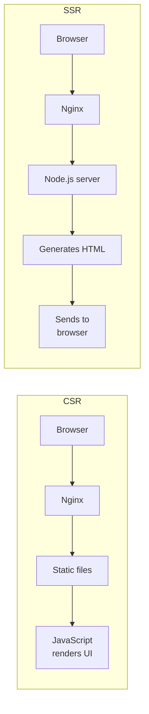
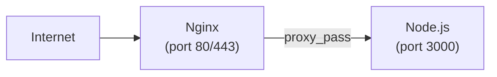

# Deploying Server-Side Rendered Apps

Server-side rendered (SSR) apps generate HTML on the server for each request. The browser receives ready-to-display HTML instead of an empty shell with JavaScript.

Examples: Next.js, Nuxt.js, Angular Universal, SvelteKit.

## How SSR Differs from CSR



The key difference: **SSR apps are running processes**. You need a Node.js server running on the machine, and Nginx acts as a reverse proxy in front of it.

## Architecture



Nginx handles:
- Public-facing HTTP/HTTPS
- SSL termination
- Serving static assets directly (faster than Node.js)
- Buffering and connection handling

Node.js handles:
- Server-side rendering
- API routes
- Dynamic content generation

## Deploying a Next.js App

### Transfer code to server

```bash
# On your local machine
scp -r ./my-nextjs-app user@your-server:/home/user/my-nextjs-app
```

### Install dependencies and build

```bash
# On the server
cd /home/user/my-nextjs-app

# Install Node.js if not present
curl -fsSL https://deb.nodesource.com/setup_lts.x | sudo -E bash -
sudo apt install -y nodejs

# Install dependencies and build
npm install
npm run build
```

### Run the app

```bash
# Test it works
npm start
# Next.js starts on port 3000 by default
# Press Ctrl+C to stop

# Verify
curl http://localhost:3000
```

### Keep it running with systemd

Create a systemd service so the app starts on boot and restarts on crash:

```bash
sudo tee /etc/systemd/system/nextjs-app.service > /dev/null <<'SERVICE'
[Unit]
Description=Next.js Application
After=network.target

[Service]
Type=simple
User=www-data
WorkingDirectory=/home/user/my-nextjs-app
ExecStart=/usr/bin/node node_modules/.bin/next start -p 3000
Restart=on-failure
RestartSec=5
Environment=NODE_ENV=production
Environment=PORT=3000

[Install]
WantedBy=multi-user.target
SERVICE

sudo systemctl daemon-reload
sudo systemctl enable nextjs-app
sudo systemctl start nextjs-app

# Check status
sudo systemctl status nextjs-app
```

### Configure Nginx

```bash
sudo tee /etc/nginx/sites-available/nextjs-app > /dev/null <<'NGINX'
server {
    listen 80;
    server_name myapp.com;

    # Serve Next.js static assets directly (much faster than proxying)
    location /_next/static/ {
        alias /home/user/my-nextjs-app/.next/static/;
        expires 1y;
        add_header Cache-Control "public, immutable";
    }

    # Serve public directory files directly
    location /public/ {
        alias /home/user/my-nextjs-app/public/;
        expires 30d;
    }

    # Proxy everything else to Next.js
    location / {
        proxy_pass http://localhost:3000;
        proxy_set_header Host $host;
        proxy_set_header X-Real-IP $remote_addr;
        proxy_set_header X-Forwarded-For $proxy_add_x_forwarded_for;
        proxy_set_header X-Forwarded-Proto $scheme;
    }
}
NGINX

sudo ln -s /etc/nginx/sites-available/nextjs-app /etc/nginx/sites-enabled/
sudo nginx -t && sudo systemctl reload nginx
```

## Deploying a Nuxt.js App

Same pattern as Next.js:

```bash
# Build
cd /home/user/my-nuxt-app
npm install
npm run build
```

### Systemd service

```bash
sudo tee /etc/systemd/system/nuxt-app.service > /dev/null <<'SERVICE'
[Unit]
Description=Nuxt.js Application
After=network.target

[Service]
Type=simple
User=www-data
WorkingDirectory=/home/user/my-nuxt-app
ExecStart=/usr/bin/node .output/server/index.mjs
Restart=on-failure
RestartSec=5
Environment=NODE_ENV=production
Environment=PORT=3000

[Install]
WantedBy=multi-user.target
SERVICE

sudo systemctl daemon-reload
sudo systemctl enable nuxt-app
sudo systemctl start nuxt-app
```

### Nginx config

```nginx
server {
    listen 80;
    server_name myapp.com;

    location / {
        proxy_pass http://localhost:3000;
        proxy_set_header Host $host;
        proxy_set_header X-Real-IP $remote_addr;
        proxy_set_header X-Forwarded-For $proxy_add_x_forwarded_for;
        proxy_set_header X-Forwarded-Proto $scheme;
    }
}
```

## Understanding systemd Services

Key commands:

```bash
# Start/stop/restart
sudo systemctl start myapp
sudo systemctl stop myapp
sudo systemctl restart myapp

# Check status and logs
sudo systemctl status myapp
sudo journalctl -u myapp -f          # Follow logs in real time
sudo journalctl -u myapp --since "1 hour ago"

# Enable/disable auto-start on boot
sudo systemctl enable myapp
sudo systemctl disable myapp
```

### Service file explained

```ini
[Unit]
Description=My App              # Human-readable name
After=network.target            # Start after network is up

[Service]
Type=simple                     # The process runs in the foreground
User=www-data                   # Run as this user (not root!)
WorkingDirectory=/path/to/app   # cd to this directory before starting
ExecStart=/usr/bin/node app.js  # The command to run
Restart=on-failure              # Restart if it crashes
RestartSec=5                    # Wait 5 seconds before restarting
Environment=NODE_ENV=production # Environment variables

[Install]
WantedBy=multi-user.target      # Start in normal multi-user mode
```

## Using PM2 as an Alternative to systemd

PM2 is a process manager specifically designed for Node.js:

```bash
# Install PM2 globally
sudo npm install -g pm2

# Start the app
cd /home/user/my-nextjs-app
pm2 start npm --name "nextjs-app" -- start

# Save the process list so PM2 restarts them on reboot
pm2 save
pm2 startup    # Follow the printed command to enable boot startup

# Useful commands
pm2 list                  # Show all running processes
pm2 logs nextjs-app       # View logs
pm2 restart nextjs-app    # Restart
pm2 stop nextjs-app       # Stop
pm2 monit                 # Real-time monitoring dashboard
```

PM2 or systemd — both work. systemd is built into Linux and manages any process. PM2 is Node.js-specific but has nicer features for Node apps (log management, cluster mode, monitoring).

## Updating the Deployment

```bash
cd /home/user/my-nextjs-app

# Pull new code (or scp new files)
git pull origin main

# Install new dependencies if any
npm install

# Rebuild
npm run build

# Restart the app
sudo systemctl restart nextjs-app
# or
pm2 restart nextjs-app
```

Nginx does NOT need to be reloaded — it's just proxying.

## Troubleshooting

**502 Bad Gateway**
- Your Node.js app is not running: `sudo systemctl status nextjs-app`
- Wrong port: verify `proxy_pass` port matches your app's port

**App crashes on start**
- Check logs: `sudo journalctl -u nextjs-app -n 50`
- Run manually first: `cd /path/to/app && npm start` — see the error directly

**Slow first page load**
- Expected with SSR — the server is rendering HTML
- Consider caching strategies or ISR (Incremental Static Regeneration) in Next.js

**Port already in use**
- Find what's using the port: `sudo lsof -i :3000`
- Kill it: `kill <PID>`

---

**Back to:** [Table of Contents](../../README.md)
