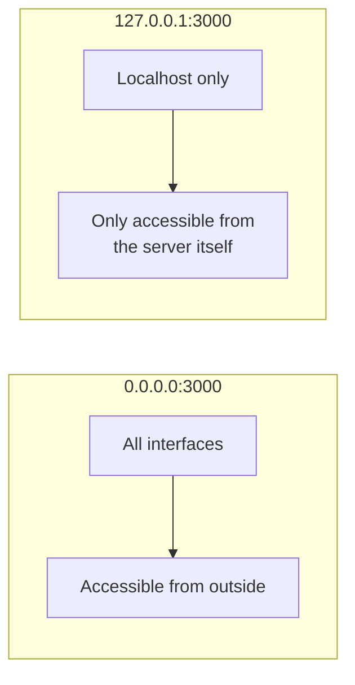
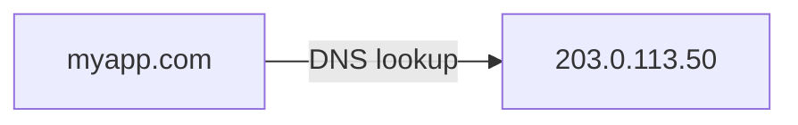
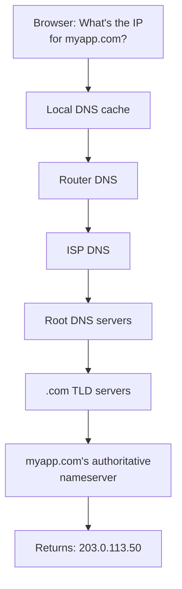

# Networking Basics

## IP Addresses

Every device on a network has an IP address.

### IPv4

```
192.168.1.100
```

Four octets, each 0-255. Total of ~4.3 billion addresses.

### Public vs Private

| Type | Range | Use |
|------|-------|-----|
| Private | `10.0.0.0/8`, `172.16.0.0/12`, `192.168.0.0/16` | Internal/local networks |
| Public | Everything else | Internet-facing |
| Loopback | `127.0.0.1` | Refers to the machine itself (`localhost`) |

Your server has a **public IP** (internet-facing) and possibly a **private IP** (internal network, e.g., in a cloud VPC).

### Checking your IP

```bash
# Public IP
curl ifconfig.me
curl icanhazip.com

# Private/local IP
ip addr show
hostname -I

# All network interfaces
ip a
```

## Ports

A port is a number (0-65535) that identifies a specific service on a machine. IP address = the building, port = the apartment number.

### Well-known ports

| Port | Service |
|------|---------|
| 22 | SSH |
| 80 | HTTP |
| 443 | HTTPS |
| 3000 | Node.js (common default) |
| 5432 | PostgreSQL |
| 3306 | MySQL |
| 6379 | Redis |
| 8080 | Alternative HTTP / App servers |
| 27017 | MongoDB |

### Checking what's listening

```bash
# All listening ports
sudo ss -tlnp

# Output:
# State  Local Address:Port  Process
# LISTEN 0.0.0.0:80          nginx
# LISTEN 0.0.0.0:22          sshd
# LISTEN 127.0.0.1:5432      postgres

# Check a specific port
sudo lsof -i :80

# Check if a port is open from outside
nc -zv server-ip 80
```

### Binding: 0.0.0.0 vs 127.0.0.1



**For backend services behind Nginx:** Bind to `127.0.0.1` — Nginx handles public traffic and proxies to localhost.

## DNS (Domain Name System)

DNS translates domain names to IP addresses.



### How DNS resolution works



### DNS Record Types

| Type | Purpose | Example |
|------|---------|---------|
| **A** | Domain → IPv4 address | `myapp.com → 203.0.113.50` |
| **AAAA** | Domain → IPv6 address | `myapp.com → 2001:db8::1` |
| **CNAME** | Domain → another domain (alias) | `www.myapp.com → myapp.com` |
| **MX** | Mail server for the domain | `myapp.com → mail.myapp.com` |
| **TXT** | Arbitrary text (verification, SPF) | `myapp.com → "v=spf1 ..."` |
| **NS** | Nameserver for the domain | `myapp.com → ns1.provider.com` |

### The records you'll set up most

```
# Point your domain to your server
A    myapp.com        →  203.0.113.50

# Point www subdomain to the same place
CNAME www.myapp.com   →  myapp.com

# Point a subdomain to your server
A    api.myapp.com    →  203.0.113.50
A    staging.myapp.com → 203.0.113.51
```

### DNS lookup tools

```bash
# Look up A record
dig myapp.com
dig myapp.com +short          # Just the IP

# Look up specific record type
dig myapp.com MX
dig myapp.com CNAME
dig myapp.com NS

# Use a specific DNS server
dig @8.8.8.8 myapp.com        # Google DNS

# Simpler tool
nslookup myapp.com
host myapp.com

# Check DNS propagation from your server
dig myapp.com +short
```

### DNS propagation

When you change DNS records, it takes time to propagate (minutes to 48 hours). During this time, some users see old records, others see new ones.

**TTL (Time To Live):** How long DNS resolvers cache a record. Lower TTL = faster propagation but more DNS queries.

```bash
# Check TTL
dig myapp.com | grep -A1 "ANSWER SECTION"
# myapp.com.   300   IN   A   203.0.113.50
#              ^^^ TTL in seconds (300 = 5 minutes)
```

**Before migrating a server:** Lower the TTL a day in advance, then change the IP, then raise TTL back up.

## Firewalls with UFW

UFW (Uncomplicated Firewall) is the simplest way to manage firewall rules on Ubuntu.

### Basic setup

```bash
# Install
sudo apt install -y ufw

# Default policy: deny incoming, allow outgoing
sudo ufw default deny incoming
sudo ufw default allow outgoing

# Allow SSH (do this FIRST before enabling, or you'll lock yourself out!)
sudo ufw allow 22

# Allow HTTP and HTTPS
sudo ufw allow 80
sudo ufw allow 443

# Enable the firewall
sudo ufw enable

# Check status
sudo ufw status verbose
```

### Common rules

```bash
# Allow specific port
sudo ufw allow 3000

# Allow specific port from specific IP only
sudo ufw allow from 10.0.0.5 to any port 5432     # PostgreSQL from one IP

# Allow a range of ports
sudo ufw allow 3000:3010/tcp

# Allow Nginx (predefined app profiles)
sudo ufw allow 'Nginx Full'

# Deny a specific IP
sudo ufw deny from 203.0.113.100

# Delete a rule
sudo ufw delete allow 3000
sudo ufw status numbered     # Show rule numbers
sudo ufw delete 3            # Delete by number

# Disable firewall
sudo ufw disable

# Reset all rules
sudo ufw reset
```

### What to allow on a web server

```bash
sudo ufw default deny incoming
sudo ufw default allow outgoing
sudo ufw allow 22        # SSH
sudo ufw allow 80        # HTTP
sudo ufw allow 443       # HTTPS
sudo ufw enable
```

That's it. Everything else is blocked.

## iptables (Advanced)

UFW is a frontend for `iptables`. You rarely need raw iptables, but knowing the basics helps:

```bash
# View current rules
sudo iptables -L -n -v

# The chain flow:
# Incoming packet → INPUT chain → Process
# Outgoing packet → OUTPUT chain → Out
# Forwarded packet → FORWARD chain → Out (for routers/Docker)
```

Docker modifies iptables directly, which is why UFW rules sometimes don't apply to Docker containers. This is a common gotcha.

## /etc/hosts

A local DNS override file. Entries here take priority over DNS.

```bash
cat /etc/hosts
```

```
127.0.0.1   localhost
127.0.1.1   my-hostname

# Custom entries
192.168.1.100   myserver
10.0.0.5        database
```

Useful for testing before DNS is set up:

```bash
# On your local machine, add:
203.0.113.50   myapp.com
# Now myapp.com resolves to your server without DNS
```

## Networking Commands Cheat Sheet

```bash
# Check connectivity
ping google.com                     # ICMP ping
ping -c 4 192.168.1.100            # 4 pings only

# Check if a port is open
nc -zv 192.168.1.100 80            # Netcat port check
curl -I http://192.168.1.100       # HTTP check (headers only)
telnet 192.168.1.100 80            # Old school

# Trace the route to a host
traceroute google.com

# DNS lookup
dig myapp.com +short
nslookup myapp.com

# Show network interfaces and IPs
ip addr show
ip a

# Show routing table
ip route show

# Show active connections
ss -tlnp                           # Listening TCP ports
ss -tunp                           # All TCP/UDP connections
netstat -tlnp                      # Legacy (needs net-tools)

# Download a file
curl -O https://example.com/file.tar.gz
wget https://example.com/file.tar.gz

# HTTP request with details
curl -v https://myapp.com          # Verbose (shows headers, TLS)
curl -I https://myapp.com          # Headers only
curl -X POST -d '{"key":"val"}' -H "Content-Type: application/json" https://api.myapp.com/data
```

## Troubleshooting Network Issues

**"Connection refused"**
- Service not running on that port
- Check: `sudo ss -tlnp | grep <port>`

**"Connection timed out"**
- Firewall blocking the port
- Check: `sudo ufw status`
- Server unreachable (wrong IP, network issue)

**"Name or service not known"**
- DNS resolution failed
- Check: `dig myapp.com`
- Check: `cat /etc/resolv.conf` (DNS server config)

**"Address already in use"**
- Another process is using the port
- Find it: `sudo lsof -i :<port>`
- Kill it: `kill <PID>`

---

**Back to:** [Table of Contents](../README.md)
