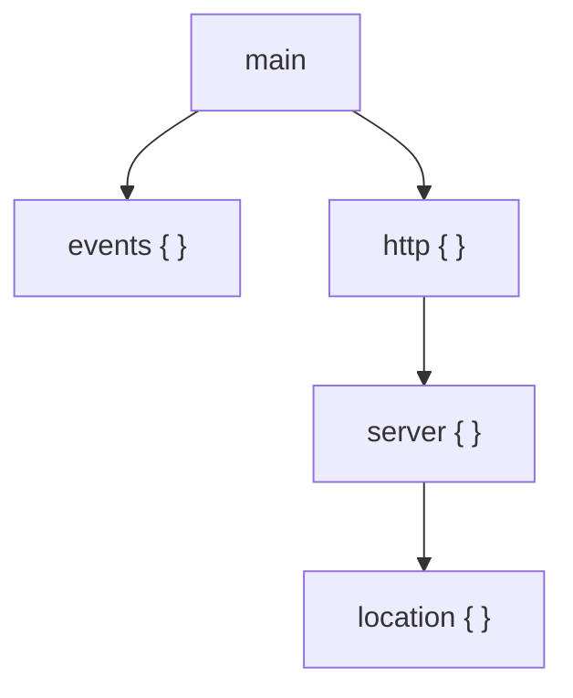

# Nginx Configuration Basics

## The Config File Structure

Nginx configuration is hierarchical. The main config file is `/etc/nginx/nginx.conf`.

```nginx
# Main context — global settings
worker_processes auto;

events {
    # Events context — connection handling
    worker_connections 1024;
}

http {
    # HTTP context — web server settings
    include /etc/nginx/mime.types;

    server {
        # Server context — a single virtual host / site
        listen 80;
        server_name example.com;

        location / {
            # Location context — how to handle specific URL paths
            root /var/www/html;
            index index.html;
        }
    }
}
```

### Context Hierarchy



Each inner context inherits settings from its parent. A directive set in `http {}` applies to all `server {}` blocks within it, unless overridden.

## Understanding Directives

A **directive** is a key-value instruction ending with a semicolon:

```nginx
listen 80;              # Simple directive
server_name example.com; # Simple directive
```

A **block directive** contains other directives inside curly braces:

```nginx
server {
    listen 80;
    server_name example.com;
}
```

## The Default nginx.conf

Let's look at what the default config does:

```bash
cat /etc/nginx/nginx.conf
```

Key parts:

```nginx
user www-data;                    # Nginx worker process runs as this user
worker_processes auto;            # Number of worker processes (auto = match CPU cores)
pid /run/nginx.pid;               # Where to store the process ID

events {
    worker_connections 768;       # Max simultaneous connections per worker
}

http {
    sendfile on;                  # Efficient file serving
    tcp_nopush on;                # Optimize TCP packets
    include /etc/nginx/mime.types; # File extension → content-type mapping

    access_log /var/log/nginx/access.log;  # Request log
    error_log /var/log/nginx/error.log;    # Error log

    include /etc/nginx/conf.d/*.conf;          # Load configs from conf.d/
    include /etc/nginx/sites-enabled/*;        # Load site configs
}
```

The `include` directives at the bottom are important — this is how your site configs get loaded.

## sites-available vs sites-enabled

This is Nginx's way of managing multiple sites:

- **`/etc/nginx/sites-available/`** — Store all your site config files here
- **`/etc/nginx/sites-enabled/`** — Symlink configs here to activate them

### Creating a new site config

```bash
# Create the config
sudo nano /etc/nginx/sites-available/myapp

# Enable it by creating a symlink
sudo ln -s /etc/nginx/sites-available/myapp /etc/nginx/sites-enabled/

# Test and reload
sudo nginx -t
sudo systemctl reload nginx
```

### Disabling a site

```bash
# Remove the symlink (NOT the original file)
sudo rm /etc/nginx/sites-enabled/myapp
sudo systemctl reload nginx
```

## Writing Your First Server Block

A **server block** (also called a virtual host) defines how Nginx handles requests for a specific domain or IP.

### Minimal static site config

Create `/etc/nginx/sites-available/mysite`:

```nginx
server {
    listen 80;
    server_name mysite.com www.mysite.com;

    root /var/www/mysite;
    index index.html;

    location / {
        try_files $uri $uri/ =404;
    }
}
```

Let's break this down:

| Directive | What it does |
|-----------|-------------|
| `listen 80` | Accept HTTP connections on port 80 |
| `server_name` | Which domain names this block responds to |
| `root` | The directory where your files live |
| `index` | Default file to serve when a directory is requested |
| `try_files` | Try the exact URI, then as a directory, then return 404 |

### Deploy it

```bash
# Create the web root and add a test page
sudo mkdir -p /var/www/mysite
echo "<h1>Hello from Nginx</h1>" | sudo tee /var/www/mysite/index.html

# Enable the site
sudo ln -s /etc/nginx/sites-available/mysite /etc/nginx/sites-enabled/

# Remove default site if still enabled
sudo rm -f /etc/nginx/sites-enabled/default

# Test and reload
sudo nginx -t
sudo systemctl reload nginx
```

## The `location` Block

The `location` block defines how Nginx handles requests matching a specific URL pattern.

### Match types

```nginx
# Exact match
location = /health {
    return 200 'OK';
}

# Prefix match (default)
location /images/ {
    root /var/www;
}

# Regex match (case sensitive)
location ~ \.php$ {
    # handle PHP files
}

# Regex match (case insensitive)
location ~* \.(jpg|png|gif)$ {
    expires 30d;
}
```

### Priority order (highest to lowest)

1. `=` — Exact match
2. `^~` — Preferential prefix match
3. `~` / `~*` — Regex match
4. (none) — Prefix match

## Common Mistakes

**Forgetting the semicolon** — Every directive must end with `;`
```nginx
# Wrong
listen 80

# Right
listen 80;
```

**Not testing before reload** — Always run `sudo nginx -t` first

**Forgetting to create the symlink** — Config in `sites-available` does nothing until symlinked to `sites-enabled`

**Permission issues** — Nginx runs as `www-data`. Your files must be readable by this user:
```bash
sudo chown -R www-data:www-data /var/www/mysite
sudo chmod -R 755 /var/www/mysite
```

---

**Next:** [Serving Static Files](serving-static-files.md)
