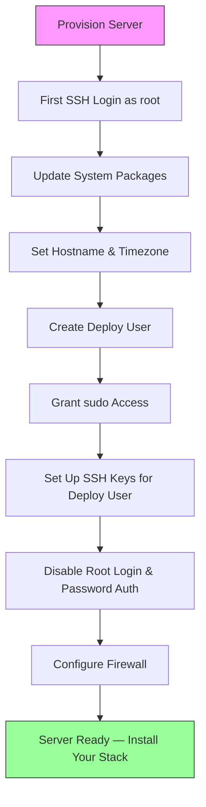
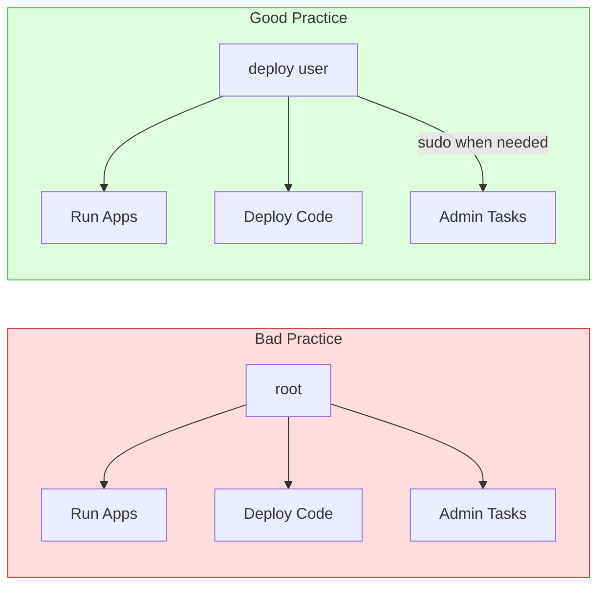
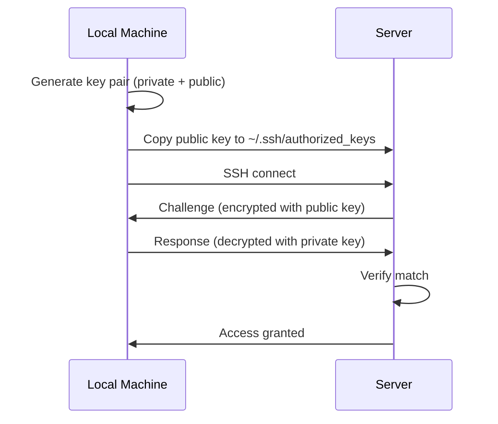
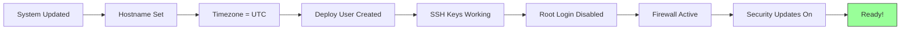

# Ubuntu Server Setup & User Creation

Setting up a fresh Ubuntu server from scratch — from your first SSH login to a production-ready baseline.

This guide assumes you've just provisioned a server from a cloud provider (AWS, DigitalOcean, Hetzner, Linode, etc.) and have a root login or default user.

---

## The Big Picture



---

## Step 1 — First Login

Most cloud providers give you either:
- A **root** password (emailed or shown in dashboard)
- A **default user** (like `ubuntu` on AWS) with your SSH key pre-installed

```bash
# If you have root access
ssh root@your-server-ip

# If the provider set up a default user (AWS, etc.)
ssh ubuntu@your-server-ip
```

If you're using a default user, prefix every root-level command below with `sudo`.

---

## Step 2 — Update the System

The first thing to do on any fresh server — update everything.

```bash
apt update && apt upgrade -y
```

What this does:

| Command | Purpose |
|---------|---------|
| `apt update` | Refreshes the list of available packages and versions |
| `apt upgrade -y` | Installs newer versions of all currently installed packages |

After upgrading, reboot if the kernel was updated:

```bash
# Check if reboot is needed
[ -f /var/run/reboot-required ] && echo "Reboot required" || echo "No reboot needed"

# Reboot if needed
reboot
```

---

## Step 3 — Set Hostname

The hostname identifies your server. Set something meaningful.

```bash
# Set the hostname
hostnamectl set-hostname web-prod-01

# Verify
hostnamectl
```

Update `/etc/hosts` to match:

```bash
nano /etc/hosts
```

Add a line:

```
127.0.1.1   web-prod-01
```

> **Naming convention:** Use a pattern like `{role}-{env}-{number}` — e.g., `api-prod-01`, `db-staging-02`, `web-dev-01`.

---

## Step 4 — Set Timezone

```bash
# See current timezone
timedatectl

# List available timezones
timedatectl list-timezones

# Set timezone (use UTC for servers — avoids DST headaches)
timedatectl set-timezone UTC

# Verify
date
```

> **Best practice:** Use **UTC** on servers. Convert to local time in your application, not on the server.

---

## Step 5 — Create a Deploy User

Never run applications or daily operations as root. Create a dedicated user.



### Create the user

```bash
# Interactive — prompts for password and details
adduser deploy
```

You'll see:

```
Adding user `deploy' ...
Adding new group `deploy' (1001) ...
Adding new user `deploy' (1001) with group `deploy' ...
Creating home directory `/home/deploy' ...
Copying files from `/etc/skel' ...
New password:
Retype new password:
passwd: password updated successfully
Changing the user information for deploy
  Full Name []: Deploy User
  Room Number []:
  Work Phone []:
  Home Phone []:
  Other []:
Is the information correct? [Y/n] Y
```

> **Tip:** Choose a strong password even though we'll disable password-based SSH login later. This password is used for `sudo`.

### Verify the user was created

```bash
# Check the user exists
id deploy
# uid=1001(deploy) gid=1001(deploy) groups=1001(deploy)

# Check home directory was created
ls -la /home/deploy/
```

---

## Step 6 — Grant sudo Access

Add the deploy user to the `sudo` group so they can run administrative commands.

```bash
usermod -aG sudo deploy
```

| Flag | Meaning |
|------|---------|
| `-a` | Append — don't remove from existing groups |
| `-G` | Specify supplementary group(s) |

### Verify sudo works

```bash
# Switch to the deploy user
su - deploy

# Test sudo
sudo whoami
# root

# Go back to root
exit
```

---

## Step 7 — Set Up SSH Keys for Deploy User

SSH keys are more secure than passwords. Set them up so you can log in as the deploy user without a password.

### On your local machine

```bash
# Generate a key pair (if you don't already have one)
ssh-keygen -t ed25519 -C "your-email@example.com"

# Copy your public key to the server
ssh-copy-id deploy@your-server-ip
```

If `ssh-copy-id` isn't available (e.g., on macOS without it installed), do it manually:

```bash
# On your local machine — copy the public key
cat ~/.ssh/id_ed25519.pub
```

```bash
# On the server — as root or deploy user
su - deploy
mkdir -p ~/.ssh
chmod 700 ~/.ssh
nano ~/.ssh/authorized_keys
# Paste your public key, save and exit
chmod 600 ~/.ssh/authorized_keys
```

### Test the key-based login

```bash
# From your local machine — should NOT ask for password
ssh deploy@your-server-ip
```



---

## Step 8 — Disable Root Login & Password Auth

Once SSH keys work for your deploy user, lock down SSH.

```bash
sudo nano /etc/ssh/sshd_config
```

Change these settings:

```
PermitRootLogin no
PasswordAuthentication no
PubkeyAuthentication yes
```

Validate and restart:

```bash
# Check config syntax
sudo sshd -t

# Restart SSH
sudo systemctl restart sshd
```

> **Critical:** Open a NEW terminal and test `ssh deploy@your-server-ip` BEFORE closing your current session. If something is wrong, you still have access through the open session.

---

## Step 9 — Configure the Firewall (UFW)

UFW (Uncomplicated Firewall) is the default firewall tool on Ubuntu.

```bash
# Allow SSH (do this BEFORE enabling the firewall!)
sudo ufw allow OpenSSH

# Set defaults
sudo ufw default deny incoming
sudo ufw default allow outgoing

# Enable the firewall
sudo ufw enable

# Verify
sudo ufw status verbose
```

Output should look like:

```
Status: active
Logging: on (low)
Default: deny (incoming), allow (outgoing), disabled (routed)

To                         Action      From
--                         ------      ----
22/tcp (OpenSSH)           ALLOW IN    Anywhere
22/tcp (OpenSSH (v6))      ALLOW IN    Anywhere (v6)
```

### Common rules you'll add later

```bash
# When you set up Nginx
sudo ufw allow 'Nginx Full'      # 80 + 443

# Or individually
sudo ufw allow 80/tcp
sudo ufw allow 443/tcp

# Custom SSH port (if you change it)
sudo ufw allow 2222/tcp
sudo ufw delete allow OpenSSH    # Remove old rule
```

---

## Step 10 — Install Essential Packages

Install tools you'll need on almost every server.

```bash
sudo apt install -y \
  curl \
  wget \
  git \
  ufw \
  htop \
  ncdu \
  unzip \
  net-tools \
  software-properties-common \
  apt-transport-https \
  ca-certificates \
  gnupg \
  lsb-release
```

| Package | Purpose |
|---------|---------|
| `curl`, `wget` | Download files and make HTTP requests |
| `git` | Clone repos for deployment |
| `ufw` | Firewall (usually pre-installed) |
| `htop` | Interactive process viewer |
| `ncdu` | Disk usage analyzer |
| `net-tools` | `ifconfig`, `netstat` and other network tools |
| `software-properties-common` | Manage PPAs and third-party repos |
| `apt-transport-https` | Download packages over HTTPS |
| `ca-certificates` | SSL certificate authorities |
| `gnupg` | GPG keys for verifying packages |
| `lsb-release` | Identify the Ubuntu version |

---

## Step 11 — Enable Automatic Security Updates

Keep your server patched without manual intervention.

```bash
sudo apt install -y unattended-upgrades
sudo dpkg-reconfigure --priority=low unattended-upgrades
```

Verify:

```bash
cat /etc/apt/apt.conf.d/20auto-upgrades
```

Expected:

```
APT::Periodic::Update-Package-Lists "1";
APT::Periodic::Unattended-Upgrade "1";
```

This auto-installs **security patches only** — not application updates.

---

## Creating Additional Users

Beyond the initial deploy user, you may need to create users for teammates or services.

### Team member with SSH access

```bash
# Create the user
sudo adduser alice

# Grant sudo (if they need it)
sudo usermod -aG sudo alice

# Set up their SSH key
sudo mkdir -p /home/alice/.ssh
sudo nano /home/alice/.ssh/authorized_keys
# Paste their public key

# Fix ownership and permissions
sudo chown -R alice:alice /home/alice/.ssh
sudo chmod 700 /home/alice/.ssh
sudo chmod 600 /home/alice/.ssh/authorized_keys
```

### Service user (no login)

For running applications — no home directory, no shell access.

```bash
sudo useradd -r -s /usr/sbin/nologin myapp
```

| Flag | Meaning |
|------|---------|
| `-r` | System user (lower UID, no aging) |
| `-s /usr/sbin/nologin` | Cannot log in interactively |

### User management cheat sheet

```bash
# List all real users (UID >= 1000)
awk -F: '$3 >= 1000 && $3 < 65534 {print $1}' /etc/passwd

# See a user's groups
groups alice

# Remove a user (keep home directory)
sudo userdel alice

# Remove a user and their home directory
sudo userdel -r alice

# Lock a user account (disable login without deleting)
sudo usermod -L alice

# Unlock a user account
sudo usermod -U alice

# Force password change on next login
sudo passwd -e alice
```

---

## Full Setup Script

Here's the full flow as a reference script. **Don't blindly run this** — understand each step first.

```bash
#!/bin/bash
# Ubuntu Server Initial Setup
# Run as root on a fresh server

set -e

USERNAME="deploy"
TIMEZONE="UTC"
HOSTNAME="web-prod-01"
SSH_PUBLIC_KEY="ssh-ed25519 AAAA... your-email@example.com"

echo "=== Updating system ==="
apt update && apt upgrade -y

echo "=== Setting hostname ==="
hostnamectl set-hostname "$HOSTNAME"
echo "127.0.1.1   $HOSTNAME" >> /etc/hosts

echo "=== Setting timezone ==="
timedatectl set-timezone "$TIMEZONE"

echo "=== Creating user: $USERNAME ==="
adduser --disabled-password --gecos "Deploy User" "$USERNAME"
usermod -aG sudo "$USERNAME"

# Allow sudo without password (optional — remove for stricter security)
echo "$USERNAME ALL=(ALL) NOPASSWD:ALL" > /etc/sudoers.d/$USERNAME
chmod 440 /etc/sudoers.d/$USERNAME

echo "=== Setting up SSH key ==="
mkdir -p /home/$USERNAME/.ssh
echo "$SSH_PUBLIC_KEY" > /home/$USERNAME/.ssh/authorized_keys
chown -R $USERNAME:$USERNAME /home/$USERNAME/.ssh
chmod 700 /home/$USERNAME/.ssh
chmod 600 /home/$USERNAME/.ssh/authorized_keys

echo "=== Hardening SSH ==="
sed -i 's/^#\?PermitRootLogin.*/PermitRootLogin no/' /etc/ssh/sshd_config
sed -i 's/^#\?PasswordAuthentication.*/PasswordAuthentication no/' /etc/ssh/sshd_config
systemctl restart sshd

echo "=== Installing essential packages ==="
apt install -y curl wget git ufw htop ncdu unzip net-tools \
  software-properties-common apt-transport-https ca-certificates \
  gnupg lsb-release unattended-upgrades

echo "=== Configuring firewall ==="
ufw allow OpenSSH
ufw default deny incoming
ufw default allow outgoing
ufw --force enable

echo "=== Enabling automatic security updates ==="
dpkg-reconfigure --priority=critical unattended-upgrades

echo "=== Setup complete ==="
echo "Log in as: ssh $USERNAME@$(curl -s ifconfig.me)"
```

---

## Post-Setup Checklist



- [ ] System packages updated
- [ ] Hostname set to something meaningful
- [ ] Timezone set to UTC
- [ ] Deploy user created with sudo access
- [ ] SSH key-based login working for deploy user
- [ ] Root login disabled via SSH
- [ ] Password authentication disabled
- [ ] UFW enabled with SSH allowed
- [ ] Essential packages installed
- [ ] Automatic security updates enabled

---

**Next steps:**
- [Server Hardening](../security/server-hardening.md) — fail2ban, Nginx security headers, rate limiting
- [SSH](../ssh/ssh.md) — Advanced SSH config, tunneling, agent forwarding
- [Package Management](../linux-fundamentals/package-management.md) — Adding repos, installing your stack
